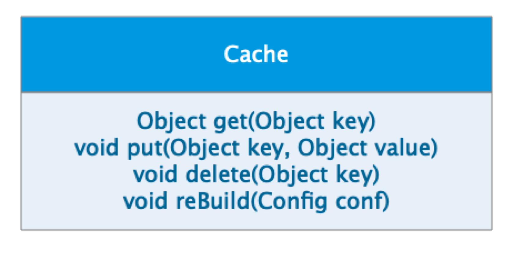

#### 作业一

* 请描述什么是依赖倒置原则，为什么有时候依赖倒置原则又被称为好莱坞原则？

在理解什么依赖倒置原则之前，先思考一个问题，诸如Tomcat/Jetty等容器，是如何做到不依赖其代码却能复用它的功能呢？
依赖倒置原则规定如下：

+ 高层模块不应该依赖于低层模块，二者都应该依赖于抽象
+ 抽象不应该依赖具体实现，具体实现应该依赖于抽象 

来细细的品读一下这两条规则：

1. 如果要是高层模块依赖了低层模块会出现什么情况呢？维护起来困难，低层只要发生变化高层势必跟着变；复用困难，这里的复用主要是指对高层模块的应用，也就是业务层面的应用。怎么解决这个问题呢？最直观的一种就是再提出一抽象层出来，双方都依赖于抽象的接口，大家只需实现接口和使用接口即可。还是先前的那个问题，Tomcat这些容器是如何做到它的功能被利用的呢，也就是说web应用在部署到tomcat之后怎么能保证，同样的程序部署到jetty中也同样能运行呢？道理其实很简单，这些web容器都实现了J2EE的规范，web应用都实现了j2EE的Servlet接口。类似的还有JDBC,程序访问数据库都不依赖于数据库驱动包，而是直接调用JDBC提供好的接口，这些接口呢被各种驱动所实现。MVC，ORM框架从这个角度上来看也都是一样的套路。

2. 在咱们的日常开发中也常常需要依赖抽象接口，而不是具体的实现。比如Web 开发中，Service 层依赖 DAO 层，并不是直接依赖 DAO 的具体实现，而是依赖 DAO 提供的抽象接口。那么这种依赖是否是依赖倒置呢？其实并不是，依赖倒置原则中，除了具体实现要依赖抽象，最重要的是，抽象是属于谁的抽象。

要理解依赖倒置原则的关键是要理清接口所有权的问题，即这些接口是被谁定义的，又被谁实现的？
接口被高层定义，高层模块拥有接口，低层模块实现接口。而不是高层模块依赖底层模块的接口，而是低层模块依赖高层的模块的接口，从而实现依赖关系的倒置。至于倒置，只是一个叫法。

好莱坞原则：Don’t call me，I will call you。对应到软件里面就是，应用程序不需要调用 Tomcat 或者 Spring 这样的框架，而是框架调用应用程序。而实现这一特性的前提就是应用程序必须实现框架的接口规范，比如实现 Servlet 接口。

#### 作业二

* 请描述一个你熟悉的框架，是如何实现依赖倒置原则的。

分析shiro安全框架如何实现依赖倒置原则：我觉得最契合依赖倒置原则的应该是Realm这一块。首先来发解一下Realm。Realm,就是域,shiro可以从Realm获取安全数据（如用户、角色、权限）,就是说SecurityManager要验证用户身份,那么它需要从Realm获取相应的用户进行比较以确定用户身份是否合法；也需要从Realm得到用户相应的角色/权限进行验证用户是否能进行操作。所以可以把Realm看成是一个安全数据源。
简单了解了一下Realm,都知道在我们的应用是可以定义多个Realm的，在运行期securityManager会按照Realm的顺序，进行身份认证。
对于依赖倒置的实现，我的理解是类似于Tomcat，shiro实现了Realm的规范，在应用中自定义的Realm只需实现Realm的接口，在运行期架构会自行调用自定义的Realm。这也就印证了，如何不依赖代码却可以复用它的功能。

#### 作业三

* 请用接口隔离原则优化 Cache 类的设计，画出优化后的类图。

cache 实现类中有四个方法，其中 put get delete 方法是需要暴露给应用程序的，rebuild 方法是需要暴露给系统进行远程调用的。如果将 rebuild 暴露给应用程序，应用程序可能会错误调用 rebuild 方法，导致 cache 服务失效。按照接口隔离原则：不应该强迫客户程序依赖它们不需要的方法。也就是说，应该使 cache 类实现两个接口，一个接口包含 get put delete 暴露给应用程序，一个接口包含 rebuild 暴露给系统远程调用。从而实现接口隔离，使应用程序看不到 rebuild 方法。

