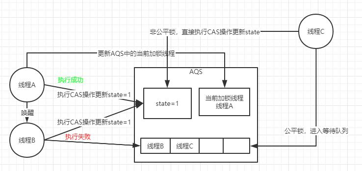
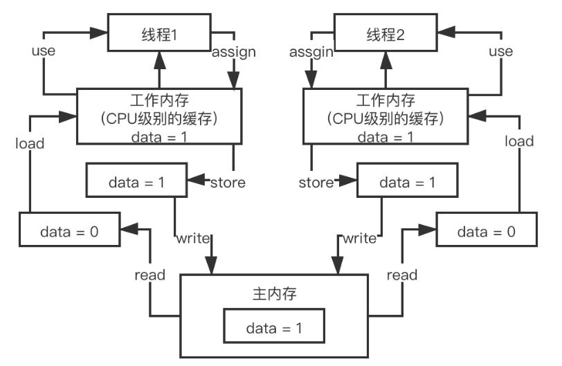
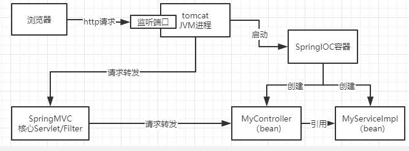
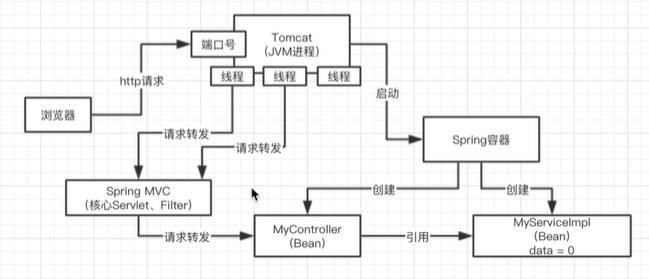
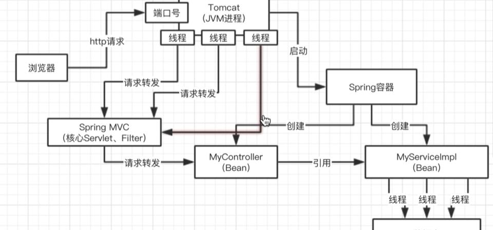
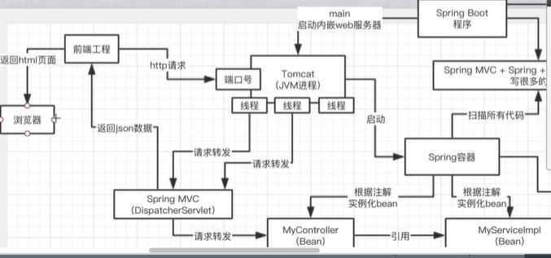
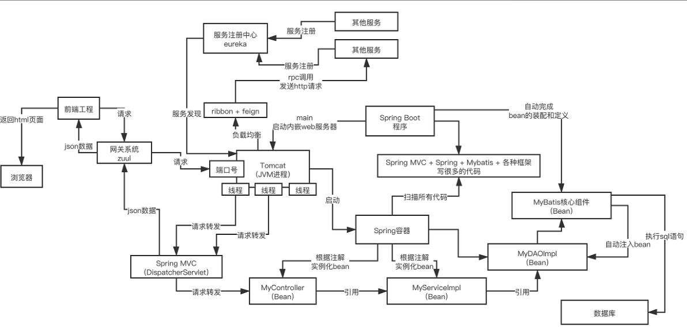
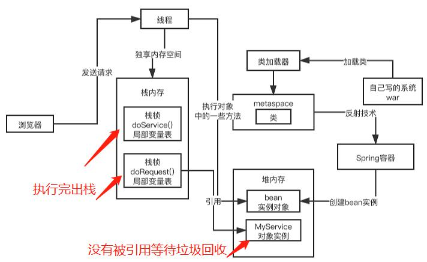

### 一般大厂怎么问

redis连环炮、mq连环炮、dubbo连环炮、分布式连环炮、ES连环炮

java并发连环炮、mysql连环炮、网络连环炮、数据结构连环炮、JDK集合连环炮、jvm连环炮、spring源码连环炮、tomcat连环炮、linux连环炮、生产实践连环炮


#### 除了学习面试突击课程之外，为了面试你还应该做哪些准备
数据结构和算法（王争，覃超）
DDD-领域驱动建模


###  HashMap基础知识

HashMap是一种数据结构，通过HashMap来进行一定的逻辑处理。

#### HashMap底层的数据结构

数组+链表

底层最核心的数据结构其实是数组，当然除了数组之外还有很多其它的东西对key计算出来一个hash值，根据这个hash值对数据进行取模，就会定位到数组中的一个元素去。

#### jdk1.8中对hash算法和寻址算法是如何优化的
* hash算法的优化：对每个hash值，在它的低16位，让高低16进行了异或，让它的低16位同时保持了高低16位的特征，尽量避免一些hash值后续出现的冲突，大家可能会乾数组的同一位置
* 寻址算法的优化：hash&（n-1)，用与运算替代取模，以此来提升性能

#### hashmap是如何解决hash碰撞问题的

hash冲突，链表（很长遍历时间复杂度是O(n)，这个时候会把链表转成红黑树，红黑树遍历时间复杂度是O(logn)

map.put和map.get-->算法优化，（避免hash冲突），寻址性能优化

两个key,多个key，他们算出来的hash值与n-1进行与运算之后，发现定位出来的数据位置还是一样的，就出现了hash碰撞（冲突）
这个时候会在这个位置挂一个链表，这个链表里面放入多个元素，让多个key-value对，同时放在数组的一个位置里
get，如果定位 到数据里发现这个位置挂了一个链表，此时遍历链表，从里面找到自己的要找的那个key-value对就可以了。
如果链表很长，遍历性能会很差，O(n)

优化，如果链表长度达到一定长度之后 ，其实会把链表转换成为红黑树去找一个元素，此时O(logn),性能会高一些.
当然并不是说长度到达8以后就一定会转成树，而是再对数组扩容进行一下判断。
MIN_TREEIFY_CAPACITY的值是64，就是说如果你的数组没有经过扩容操作的情况下，如果链表长度已经超过8了，此时不转树状结构，而是进行数组扩容，数组扩容时会重新散列，将链表的节点均匀的分布，查询效率对比转树状结构也要好

ps:红黑树的遍历为什么时间复杂度为什么是O(logn)

#### hashmap是如何进行扩容
底层是一个数组，当这个数组满了之后会进行自动扩容 ，变成一个更大的数组，重新计算hash（rehash)

rehash不是对全部的元素进行取模，而是判断二进制结果中是否多一个bit，如果没有多就还是原来的位置不用变，如果多出来那么就是index+oldCap,通过这种方式，就避免了rehash的时候，用这个hash对新的数组长度取模，取模性能不高，位运算性能比较高。


### 并发编程问题
synchronized实现原理、cas无锁化的原理、AQS是什么、Lock锁、ConcurrentHashMap分段加锁的原理、线程池的原理、java内存模型、volatile原理，java并发包有什么了解

只要技术含量稍微高一点的系统，并发包下面的东西还是很容易会用到的。

#### synchronized关键字底层原理
```java
synchronized(myObject){
	//一大堆的代码
	synchronized(myObject){
		//一大堆代码
	}
}

```

底层原理：跟jvm指令和monitor有关系。

```c++

monitorenter
//代码对应指令
monitorexit

```

synchronized是有一个加锁（对应指令monitorenter）和解锁（对应指令monitorexit）的概念的。monitor里面有一个计数器，从0开始的。如果一个线程要获取monitor的锁，就看看他的计数器是不是0，如果是0的话，那么说明没人获取锁，他就可以获取锁了，然后对计数器加1

这个monitor的锁是支持重入加锁的

#### cas的理解以及其底层实现原理

多线程访问共享数据，会有线程安全问题，这时候就可能要用到很多并发包下面的技术
synchronized ,多线程并发去执行synchronized加锁对象，效率并不高，相当于是串行的。
AtomicInteger，并发包提供的原子类，底层是基于CAS来进行实现的。
```java
public class CASDemo {

    private AtomicLong count = new AtomicLong(0);
    private void add10K() {
        int idx = 0;
        while(idx++ < 10000) {
            count.incrementAndGet();
        }
    }


    public static void main(String[] args) throws InterruptedException{
        CASDemo cas=new CASDemo();
        Thread th1=new Thread(()->{
            cas.add10K();
        },"t1");
        Thread th2=new Thread(()->{
            cas.add10K();
        },"t1");
        th1.start();
        th2.start();

        th1.join();
        th2.join();

        System.out.println(cas.count);
    }
}
```

CAS(?),在底层的硬件级别给你保证一定是原子的，同一时间只有一个线程可以执行CAS，先比较再设置，其他的线程的CAS同时间去执行此时会失败

compareandset是java并发包封装的api,compareandswap是compareandset的底层实现


#### concurrenthashmap底层实现原理

多线程同时读写hashmap,解决线程安全的问题为什么不用synchronized对hashmap这个对象加钞呢？粒度太粗了，为什么呢，可能不同的线程进来之后要操作的本来就不是一个元素，这时候加锁的话明显影响了性能，也没必要。转换一下思路如果只对某一个元素进行限制呢？

引入ConcurrentHashMap,它默认实现了线程安全性。
Jdk1.7`分段加锁`，（分段：数组1、数组2，数组3），不同的线程在不同的分段里面加数据不存在线程安全性问题的。

jdk1.8以后对锁的粒度再一次的细化，对于数组里的每个元素进行put操作，都有一个不同的锁。刚开始put的时候，如果两个线程都是在数组[5]这个位置进行put操作，这个时候对数组[5]这个位置进行put的时候，采取的是CAS的策略。
这也是更细粒度的`分段加锁`，通过对数组的每个元素执行CAS策略，如果是很多线程对数组里不同的元素执行put，大家都是没有关系的。如果其他线程操作失败了，其他线程此时会发现数组[5]这个位置刚才已经有人放进去值了。此时就需要在这个位置基于链表+红黑树来进行处理，synchronized(数组[5])即对元素加锁，基于链表+红黑树在这个位置插入自己的数据。

jdk1.8以后，如果是对数组里同一个位置的元素进行操作，才进行加锁串行化处理，如果是对数组不同位置的元素操作，大家是可以并发执行的

源码：分段计数，size(contercell累加)

basecount用来记录元素个数的成员属性，默认值为0， 

#### AQS实现原理

ReentrantLock 

state变量-->CAS-->失败后进入队列等待-->释放锁后唤醒

非公平锁，公平锁

多线程同时访问一个共享数据，可以用synchronized,CAS,ConcurrentHashMap(并发安全的数据结构),还可以用Lock

```java

ReentrantLock lock=new ReentrantLock()
lock.lock();
lock.unlock();
//这点跟Synchronized还是有点不一样的，自己补充
```

ReentrantLock底层是基于AQS来实现的，其他API,Semaphore，CountDownLunch、CircleBarrier等其他并发包下的工具。

AQS:AbstractQueueSynchronizer,抽象队列同步器，AQS有一个核心的变量state.
AQS核心属性：state，当前加锁线程，等待队列

多线程同时执行lock.lock()，底层加锁是通过AQS实现，过程是通过CAS来更新state=1。比如线程A更新state成功，接下来就会把线程A在AQS队列中设置为当前加锁线程。线程B更新state失败，则线程B就会进入到等待队列，并挂起线程B。
线程A执行完成，会释放锁，重新把state设置为0，当前加锁线程设置为空，同时唤醒等待队列中队首的线程B，队首线程重复上述过程

默认情况下用的非公平锁，以上述过程为例，虽然线程A唤醒了队首线程B，但是该线程在执行CAS操作的时候，又有其它线程C（可能不是等待队列中的元素）先于该线程对state更新成功，这个时候该线程B又是非常的无奈只能再次回到等待队列中去，这个场景就是非公平锁的表现，非常的不公平哈。

如果是公平锁（即在构造函数中传入参数为true),同样以上述过程为例，线程A唤醒了队首线程B，此时再有其它线程C到来会先看等待队列中是否有元素，如果有就直接插入到等待队列中并挂起，等待被唤醒。

ps:CAS与自旋是什么关系？


### 线程池
#### 线程池的底层原理

系统是不可能说让他无限制的创建很多很多的线程的，会构建一个线程池，有一定数量 的线程，让他们执行各种各样的任务，线程执行完任务之后 ，不要销毁，继续等待去执行下一个任务。

频繁的创建线程、销毁线程

```java
	ExecutorService threadPool=Executors.newFixedThreadPool(3);
	threadPool.submit(new Callable(){
		public void run(){
			
		}
	});
```

coolPoolSize,只要线程池的线程数量小于coolPoolSize,都会直接 创建新的线程来执行这个任务，任务执行完就尝试从无界队列里获取任务，直到线程池里有coolPoolSize个线程。
接着再次提交任务，会发现线程数量已经和coolPoolSize一样大了，此时就直接把任务放入队列中就可以了，线程会争抢获取任务执行的，如果所有线程此时都在执行任务，那么无界队列里的任务就可能会越来越多。

fixed，队列-无界阻塞队列-LinkedBlockingQueue


#### 线程池核心参数
* coolPoolSize：核心线程数
* maximumPoolSize：Integer.MAX_VALUE 最大线程数
* keepAliveTime：60s,释放额外线程的等待时间
* new ArrayBlockingQueue<Runnable>(200):有界队列

如果说你把queue做成有界队列，比如说new ArrayBlockingQueue<Runnable>(200)，那么假设corePoolSize个线程都在繁忙的工作，大量任务进入有界队列，队列满了，此时怎么办？
这个时候假设你的maximumPoolSize是比corePoolSize大的，此时会继续创建额外的线程放入线程池里，来处理这些任务，然后超过corePoolSize数量的线程如果处理完了一个任务也会尝试从队列里去获取任务来执行
如果额外线程都创建完了去处理任务，队列还是满的，此时还有新的任务来怎么办？
只能reject掉，他有几种reject策略，可以传入RejectedExecutionHandler

1. AbortPolicy 
2. DiscardPolicy  
3. DiscardOldestPolicy
4. CallerRunsPolicy 
5. 自定义
如果后续慢慢的队列里没任务了，线程空闲了，超过corePoolSize的线程会自动释放掉，在keepAliveTime之后就会释放
根据上述原理去定制自己的线程池，考虑到corePoolSize的数量，队列类型，最大线程数量，拒绝策略，线程释放时间
一般比较常用的是：fixed线程，


#### 线程池中使用无界队列会出现什么问题
在远程服务异常的情况下，使用无界阻塞队列，是否会导致内存异常飙升？
调用超时，队列会变得越来越大，此时会导致内存飙升起来，而且还可能会导致OOM

#### 线程池队列满了之后，会发生什么事情
如果使用有界队列，可以避免内存溢出。但有界队列在流量突然特别大的情况下，也会出现问题。队列满了，创建很多额外线程。
如果不限制的创建额外线程，每个线程都会有自己的栈内存，占用一定的资源，届时也会导致内存资源耗尽，系统也会崩溃掉。
即使内存没有耗尽，线程数过多，CPU负载过高的话也会崩溃

无界队列会OOM，有界队列创建线程过多也会出此类问题。到底选择无界队列，还是有界队列根据场景来选择。
能挺去就挺过去了，实在没办法了就需要考虑reject策略了。建议自定义reject策略，如果线程池无法执行更多任务了此时就把这个任务给持久化到磁盘里去，后台专门启动一个线程，后续等待线程池工作负载降低之后，再慢慢去消化这些任务。

#### 如果线上机器宕机，线程池的阻塞队列中请求怎么办

任务都放到队列里面了，如果宕机了，就会导致队列里的任务就丢失了。

有什么解决方案呢？如果说要提交一个任务到线程池里去，去提交之前，可以先把任务信息给持久化到数据库里，使用状态（未提交、已提交、已完成）对该任务信息进行维护，提交之后就把该任务的状态置为已提交。

系统重启之后，后台线程去扫描数据库里未提交和已提交状态的任务，把这些任务读取出来重新提交到线程池里面去，继续执行。


### java内存模型


#### 内存模型


CPU缓存

read load use assgin store write的过程

#### java内存模型的原子性、有序性、可见性

volatile实现原理
happens-before
内存屏障

可见性：某一个线程对数据修改之后，其它线程在读取数据时可以看到修改之后的结果 
原子性：某一个线程对数据修改过程是独占的，其它线程不能参与
有序性：jvm有时候为了提高代码的执行效率会将指令进行优化重排

#### volatile实现原理

讲volatile关键字一定要从java内存模型讲起，接着是原子性、有序性、可见性，接下来就是volatile

volatile是用来解决可见性和有序性的，

加上volatile关键字之后，线程A更新数据后，会强制刷回主存，同时其它线程该数据的缓存会失效，其它线程在用该数据时，会强制从主存重新读取该数据。
在大量的开源中间件系统，都使用了volatile。使用场景kafka.

#### happens-before原则

在一定程度上避免指令重排的

1、程序次序规则：一个线程内，按照代码顺序，书写在前面的操作等等发生于书写在后面的操作
2、锁定规则：一个unlock操作先行发生于后面对同一个锁的lock操作，比如说在代码里面先对一个lock.unlock()
3、volatile变量规则：一个volatile变量的写操作先行发生于后面对这个变量的读操作
4、传递规则 ：如果操作A先行发生操作B,而操作B又先行发生于操作C,则可以得出操作A先行发生操作C
5、线程启动规则：Thread对象的start()方法 先行发生于此线程的每一个动作，thread.start()，thread.interrupt()
6、线程中断规则：线程interrupt()方法的调用 先行发生于被中断线程的代码检测到中断事件的发生
7、线程终结规则：线程中所有的操作都先行发生于线程的终止检测，我们可通过thread.join()方法结束、Thread.isAlive()的返回值手段检测到线程已经终止执行
8、对象终结规则：一个对象的初始化完成先行于他的finalize()方法的开始


以上这8条原则的意思很显而易见，就是程序中代码如果满足这个条件，就一定会按照这个规则来保证指令的顺序。

规则不用背，只是指定了在一些特殊情况下不允许编译器、指令器对你写的代码进行指令重排，必须保证你的代码的有序性。

指令重排-->happens-before--->volatile（可以起到避免指令重排的作用）


#### volatile底层是如何基于内存屏障保证可见性和有序性的

连环炮：内存模型 ->原子性、可见性、有序性-->volatile+可见性（更新一个变量之后可以保证，失效这个变量在其他线程的工作内存里的缓存，保证其它线程可以立马得最新值）-->volatile+有序性（指令重排、happens-before）-->volatile+原子性-->volatile底层原理（内存屏障级别的原理）

volatile+原子性：volatile不能保证原子性，极端情况下有保证原子性的效果（如64位的long数据加上volatile之后）

保证原子性，还需要synchronized，lock，加锁

volatile底层原理:内存屏障（禁止重排序）（load load store）
如果对变量使用了volatile关键词，对这个变量进行读写的时候，在底层前后都加入了内存屏障。
如何保证可见性：对volatile修饰的变量，执行写操作的话，JVM会发送一条`lock前缀指令`给CPU,cpu在计算完之后会立即将这个值写回主内存，同时因为有`MESI缓存一致性协议`，所以各个CPU都会对总结进行`嗅探`，自己本地缓存中的数据是否被别人修改，如果发现别人修改了某个缓存的数据，那么CPU就会将自己`本地缓存的数据过期掉`，然后这个CPU上执行的线程在读取那个变量的时候，就会从主内存中重新加载最新的数据了。

并发这块，往深了讲，
synchronized、volatile，底层都对应着一套复杂的cpu级别的硬件原理，大量的内存屏障的原理；
lock API，concurrenthashmap，都是各种复杂的jdk级别的源码，技术深度是很深入的


### Spring

#### springIoc机制

springIoc框架，控制反转、依赖注入

spring容器，根据xml配置或者注解，去实例化你的一些bean对象，然后根据xml配置或者注解，去对bean对象之间的引用 关系，进行依赖注入，某个bean依赖了另外一个bean

底层的核心技术，反射，通过反射技术，直接根据你的类去自己构建对应的对象出来，就是反射技术 

Ioc最大的作用就是实现了类与类之间的彻底的解耦



#### AOP机制的理解
数据库的事务 ，
事务机制，一个事务里的所有sql，要么一起成功，要么一起失败，事务功能可以保证 我们数据的一致性。所以在业务逻辑组件里加入这个事务。

spring aop机制关键概念：做一个切面，如何定义呢？命名为MyserviceXXX的这种类，在这些类的所有方法中，都织入一些代码，让所有这些方法刚开始运行的时候 都 先去开启一个事务 ，在所有这些方法运行完毕之后，去根据 是否抛出异常来判断一下，如果抛出异常，就回滚事务 ，如果没有异常就提交事务 。
===》AOP 面向切面编程 ，Aspect

spring在运行的时候，使用动态代理技术（AOP的核心技术），他会给你的那些类生成动态代理。
```Java

	@Controller
	public class MyController{
		@Resource
		private MyserviceA myserviceA;//注入的是动态代理的对象实例，ProxyMyserviceA
		
			
		public void doRequest(){
			myserviceA.doServiceA();直接调用动态代理的对象实例ProxyMyserviceA
		}
		
		
	}
	public class ProxyMyserviceA implements MyserviceA{
		private MyserviceA myserviceA;
		
		public void doServiceA(){
			//开启事务
			
			//直接调用 serviceA对象的方法
			myserviceA.doServiceA();
			
			//根据是否抛出异常，回滚事务/提交事务
		}
		
		
	}
```


#### cglib动态代理？跟动态代理的区别是什么

优先是jdk的动态代理，其次是cglib动态代理，两种代理的代理示例：

其实就是动态的创建一个代理类出来，创建这个代理 的实例对象，在这个里面引用 你真正自己写的类，所有的方法的调用 ，都是先走代理类对象，他负责做一些代码上的增强，再去调用你写的那个类

spring里使用Aop,比如说你对一批类和他们的方法做了一个切面 ，定义好要在这些类的方法里增强的代码，spring必然要对那些类生成 动态代理，在动态代理 中执行你定义 的一些增强代码。

`如果你的类是实现了某个接口`，springaop会使用jdk动态代理
生成一个跟你实现 同样接口的一个代理类，构造出一个实例对象，jdk动态代理，他其实 是在你的类有接口的就会来使用

`很多时候我们可能某个类是没有实现接口的`，springaop会改用cglib来生成动态代理
他是生成 你的类的一个子类，可以动态生成字节码，覆盖你的一些方法，在这方法里加入增强代码。


#### springbean是线程安全的吗？

spring容器中的bean可以分为5个范围(作用域)：

1. singleton:默认，每个容器中只有一个bean实例
2. prototype:为每一个bean请求提供一个实例
一般来说下面几种作用域，在开发过程都不会用到，99.99%的时候 都用singleton。
3. request:为每一个网络请求创建一个实例，在请求完成以后，bean会失效并被垃圾回收器回收
4. session:与Request范围类似，确保每一个session中只有一个bean的实例，在session过期后，bean会随之失效
5. golbalsession:

是否线程安全呢？绝对不可能是线程安全的。springbean默认来说，都线程不安全的。

对于javaweb系统来说，很少在springbean里放置一些实例变量，一般来说他们都是多个组件互相调用 ，最终去访问数据库。


#### spring传播机制

1. PROPAGATION_REQUIRED
2. PROPAGATION_SUPPORTS
以下都用的很少
3. PROPAGATION_MANDATORY
4. PROPAGATION_REQUIRE_NEW
5. PROPAGATION_NOT_SUPPORTED
6. PROPAGATION_NEVER
7. PROPAGATION_NETSTED

#### spring 核心架构

IOC 容器使用反射技术来创建并管理bean
AOP 使用动态代理技术来完成方法的增强

#### spring web mvc的核心架构
1. tomcat的工作线程将请求转交给spring mvc框架的DispatcherServlet
2. DispatcherServlet查找@Controller注解的controller，我们一般会给controller加上你@RequestMapping的注解，标注说哪些controller用来处理哪些请求，此时根据请求的uri，去定位到哪个controller来进行处理
3. 根据@RequestMapping去查找，使用这个controller内的哪个方法来进行请求的处理，对每个方法一般也会加@RequestMapping的注解
4. 他会直接调用我们的controller里面的某个方法来进行请求的处理
5. 我们的controller的方法会有一个返回值，以前的时候，一般来说还是走jsp、模板技术，我们会把前端页面放在后端的工程里面，返回一个页面模板的名字，spring mvc的框架使用模板技术，对html页面做一个渲染；返回一个json串，前后端分离，可能前端发送一个请求过来，我们只要返回json数据
 6. 再把渲染以后的html页面返回给浏览器去进行显示；前端负责把html页面渲染给浏览器就可以了

#### springboot核心架构
springboot启动时候的流程图。

在一定程度上来简化开发流程

有很配置，定义很多bean，流程比较繁琐

springboot内嵌一个tomcat，可以很方便直接运行一个方法，就可以直接 把web容器给跑起来。


自动装配，比如在集成 mybatis，只需要引入一个starter依赖就可以了。自己补充吧。。。

#### spring cloud核心架构

核心组件：网关（zuul)、注册中心（Eureka)、Ribbon(负载)、Feign(rpc)
辅助组件：hystrix、链表追踪等其他组件都是服务于分布式系统的，其中hystrix主要用于服务间调用的熔断、降级。


#### spring 中的设计模式
工厂，单例，代理
从spring源码底层去看，会有很多种设计模式的运用

最基础的就是以上三种设计模式
工厂（IOC容器）:工厂模式，spring ioc核心的设计模式的思想提现，他自己就是一个大的工厂，把所有的bean实例都给放在了spring容器里（大工厂），如果你要使用bean，就找spring容器就可以了，你自己不用创建对象了
单例 bean的作用域:spring默认来说，对每个bean走的都是一个单例模式，确保说你的一个类在系统运行期间只有一个实例对象，只有一个bean，用到了一个单例模式的思想，保证了每个bean都是单例的
代理 AOP:如果说你要对一些类的方法切入一些增强的代码，会创建一些动态代理的对象，让你对那些目标对象的访问，先经过动态代理对象，动态代理对象先做一些增强的代码，调用你的目标对象


在设计模式里，就是一个代理模式的体现和运用，让动态代理的对象，去代理了你的目标对象，在这个过程中做一些增强的访问，你可以把面试突击的内容作为一个抛砖引玉的作用，去更加深入的学习一些技术


#### spring总结图



### JVM

#### JVM内存区域和Java8做了那些改进

执行我们的一些对象的方法，执行代码的时候肯定会有很多的线程，tomcat里就有很多自己的工作线程，去执行我们写的代码，每个工作线程都会有自己的一块数据结构，栈内存，这个里面是存放一些东西
java 8以后的内存分代的改进，永久代里放了一些常量池+类信息，常量池 -> 堆里面，类信息 -> metaspace（元区域）

#### JVM是如何运行的，对象是如何分配的


#### JVM在哪些情况下会触发垃圾回收
java内存模型：分代对象：young区（年轻代、Eden区、Survivor1区、Survivor2区）、old区（老年代）

1. 当Eden区满的时候会触发垃圾回收，young gc，回收的对象不包括：正在使用实例以及类中的静态变量

垃圾回收时有一很重要的概念是stw(stop the world),什么意思呢，这会停止jvm里面工作线程的执行，另一个垃圾回收的线程，这个线程专门用来扫描所有对象，判断哪些是可以回收的，哪些是不可以回收的。对不可回收的对象就直接回收了，对于不可回收的会采用`复制算法`，复制到Survior区中某一个区中去。

年轻代对象什么时候会转移到老年代中去呢？
* 在年轻代中，经过多次垃圾回收，此时会认为这个对象是长期存活对象（如spring容器里的bean)
* S区中放不下的情况，会直接放到老年代中
* 创建特别大的对象时，也会放到老年代中

#### 发生OOM之后 ，如何 排查和处理线上系统的OOM问题

oom可能发生在哪几个区域，解决的一个思路，在jvm里可以设置几个参数，如果一旦jvm发生了oom之后，就会导出一份内存快照，就会有当时的线上内存里的对象的一个情况，可以用MAT这样的工具，可以去分析。无非就是找出来当时的时候占用内存最大的对象都是谁，找出来那些对象是在代码中哪些地方创建出来的，一般来说就是可能会对内存去做一个调优

找他自动导出的内存快照，分析，XX对象，直接去定位代码，修改代码


### 计算机基础
