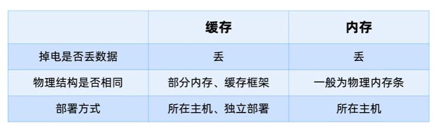

### 缓存

web端：页面缓存
移动端：App缓存
服务端：数据库缓存、应用缓存、平台级缓存

框架的选型：穿透、雪崩、分布式环境下缓存一致性问题，生产事故

关键点：
对框架原理有深入了解
如何才能熟练使用缓存框架
缓存在不同业务场景下如何使用

内容：
基础理论篇：缓存规范
动手学习篇：redis多线程模型
实践技巧篇：缓存一致性，分布式锁
综合案例篇：使用案例

#### 基础理论篇

缓存定义：可以进行高速数据交换的存储器

系统级缓存：硬件缓存、CPU缓存（CPU与内存之间的高速缓存L1d Cache(数据缓存) L1i Cache（指令缓存）、L2 Cache、L3 Cache）

缓存与内存的区别：

缓存淘汰策略：
先进先出-FIFO 
最不经常使用-LFU
最近最少使用-LRU

缓存应用场景：
前提：应用抗不住并发量的时候才会使用缓存
1. 将数据库的部分数据加入缓存（数据量比较大，热点数据）
2. 列表排序分页等场景（有时候一些数据会经常改变，我们会经常对一些数据进行分页或者是把一些数据库的数据拿出来做排序，这种情况下可能会将这些数据加入缓存中，然后在缓存当中进行排序、分页等等这些操作，来提交一些效率）
2. 计数器：用缓存来做并发计数、
3. 详情内容数据缓存（详情页）
4. 分布式session(
5. 热点数据排名（第五？评价系统，积分排名系统)
6. 发布订阅（轻量级的发布订阅模型）
7. 分布式锁（数据库、zk、consul、etcd、redis)

