容器用途
1、标准化打包（集装箱）
2、隔离（集装箱）
3、标准化部署

虚拟机
hypervisor
强隔离机制（隔离性好）

容器更轻量级

docker窗口核心技术 
cgroups (cpu cpuset memory device)
namespace(pid mnt ipc uts net)
networking (veth bridge iptables)
storage(device-mapper btfrs aufs)

容器镜像
固化的操作系统，不是完整的操作系统

共享宿主机内核
分层组织方式，方便镜像层复用

docker架构
client(docker build /pull/run)
docker host(docker deamon)
registry(docker hub )

docker compose
多容器部署，一键部署
docker compose up
适用于本地测试环境 
生产环境，kubernetes云平台 

## 容器镜像构建dockerfile解析
### springboot如何做容器化

```bash
//dockerfile
from java:8-jdk-alpine
copy ./target/xxx.jar /usr/app
workdir /usr/app
entrypoint ["java","- jar "," xxxx.jar"]
```

 ### 单页应用如何容器化
 ```bash
 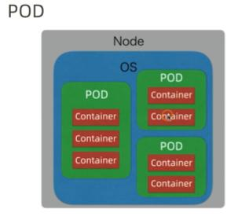
 
 ```
 
 到底什么是云原生架构？
 基于微服服原理而开发的应用，以容器方式打包。在运行时，
 容器由运行于云基础设施之上的平台进行高度。应用开采用持续交付和devops实践。
 
 kubenetes解决什么问题
 本质上简化微服务的开发和部署
 
 把微服务的关注点都以组件的形式提供出来
 
## kubernetes架构
 典型的master -slave架构，master多节点部署，真正做调度的只有一个master节点，这里头有一个选主的动作。 如一个主master节点挂，其他的节点就会再选一个主master顶上去，这个动作也是由etcd来完成的。
### master节点组件
#### etcd
 基于key-value分布式存储机制，底层采用raft协议, 状态数据：配置、节点pod，最终都存储在etcd中。etcd集群单独部署
 
#### api server
对外提供操作或获取Kubernetes集群资源的api, 唯一操作etcd的组件，其他组件 ，管理员操作都能是通过apiserver进行操作， 进行交互，可以理解 为etcd的代理proxy
 
#### scheduler
Kubernetes集群的大脑，做调度决策，比如 对于新的应用发布请求，scheduler负责决策相应的pods应该分布在哪些worker节点上
 
#### controller manager
相当于是集群状态的协调者，观察目前集群的实际状态，和etcd当中的预期状态两者进行比对 ，不一致就对资源进行协调操作。 让两个状态达到最终一致，Kubernetes采用最终一致调度机制，这种机制支持自愈(self-healing)。不管是后续节点挂还是容器挂，都能最终恢复， 即使在严重故障的情况，只要etcd中的预期数据还在，Kubernetes都能最终恢复到最终预期状态。
 
 
 
### worker节点组件 
#### container runtime
下载镜像和运行容器的组件，如果采用docker，每个节点都运行一个docker deamon,运行容器的时候，如果本地没有镜像，deamon会从docker registry上抓取镜像。
 
#### pod
Kubernetes中特有的概念，可以理解为对容器的一个包装，是Kubernetes的基本调度单位。实际容器是跑在pod中，一个节点可以启动一个或多个pod，一个应用的pods的可以分布一个或多个节点上。
 
#### kubelet
管理worker节点的组件 ，相当于一个agent角色 ，和master节点的api server进行交互，接收指令执行操作。如启动pod、关闭pod， 也返回状态数据，或者事件返回到mster。 如scheduler-Kubernetes集群的大脑，kubelet是每个worker节点的小脑
 
 
#### kube-proxy
负责对pod进行寻址和负载均衡的组件，是实现service 和服务发现抽象的关键，底层操作iptable规则。
 
用户操作Kubernetes集群，一般是通过kubectl,命令行工具，或者dashboard，如果有需要，可以通过api sdk，直接开发工具来访问Kubernetes集群， 背后这些工具都通过api esrver和Kubernetes集群进行交互。
 
Kubernetes和pod之间进行通讯，走的都是overlay覆盖网络，外部流量进入Kubernetes访问pod,一般是通过lb（负载均衡）设备。此外集群的外围一般还有存储、监控、日志、分析等配套的服务。
 
### 总结
架构比较复杂重量，自己搭建和运维一套生产级的Kubernetes集群 ，中小企业不建议自建或运维Kubernetes集群，建议采用公用云Kubernetes。比如阿里云的Kubernetes集群服务
 
 
 
 
 
## Kubernetes基本概念


### 集群 Cluster
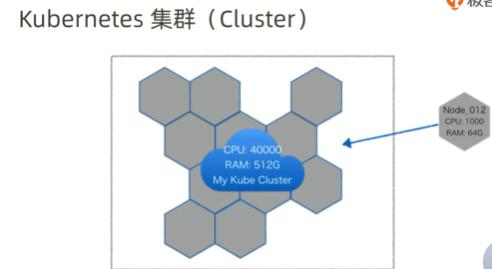
有很多节点组成，可以按照增加节点，节点可以物理机，也可以虚拟机
整个集群可以抽象 看作是一个越大计算机，cpu 和内存容量是所有节点的总和。可以按需给超大计算增加更多的cpu和内存

### 容器 Container
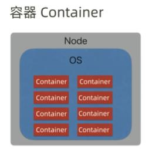
Kubernetes是容器调度平台 ，容器是基本概念。容器轻量级虚拟化技术 ，宿主机操作系统的角度来看，容器是一个又一个的进程。
从容器内部视角，感觉就是一个完整的操作系统 ，有自己的文件系统、cpu、网络、内存等

### POD

Kubernetes并没有直接调度容器，而是在外面重新封装了一个叫pod的概念
pod是Kubernetes的基本调度单位 ，一个pod里面可以有一个或多个容器，共享pod的文件系统和网络。每个pod有独立的ip,pod里面的容器共享ip和端口空间，并且 同一个pod里面的容器，通过 localhost相互访问。大部分情况下，一个pod只有一个应用容器。

封装Pod概念的原因是，
1、考虑一些需要辅助容器的场景 ，比如 一个需要sidecar的场景 
2、考虑替换使用不同的容器技术 

### 副本集 ReplicaSet

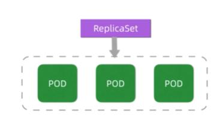

一个应用在发布的时候一般不是只发布一个pod实例，为了实现HA也会发布多个pod实例。
就是和一个应用的一组pod相对应的概念，可以通过模板（yaml,json）来规范某个应用的容器、镜像、端口副本数量、volume、健康检查机制等，都可以通过模板来规范。
运行时，replicaset会监控和维护pod数量，少了会增加，多了会减少。replication controller替代品 了

### 服务 Service

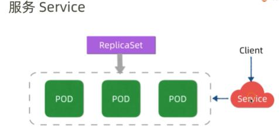
pod是Kubernetes中是一个ifumurable(不固定的)，有可能会随时挂，重启（预期的，非预期的）。这样就会导致服务ip会不断变化，如果服务实例ip不固定，会随时变化，那么服务的消费者如何才能寻址呢？Kubernetes通过引入service这样一个抽象概念来解决这个问题，service屏蔽了应用的ip寻址和负载均衡这些细节，消费方可以直接通过服务名来访问目标服务，Kubernetes中的service的底层机制会做寻址和负载均衡，即使应用的podip发生变更 ，service也会屏蔽这种变更，让消费方无感知。是Kubernetes的重要概念


### 发布 Deployment
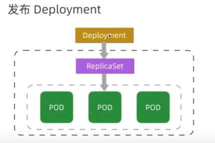

副本集可以认为是一种基本的发布机制，也可以实现高级的发布功能，比如（金丝雀、蓝绿、滚动发布）也可以通过replicaset来实现，但是这个操作起来比较麻烦。为了简化这些高级的发布，Kubernetes在replicaset的基本上，又引入了deployment的概念。
就是用来管理replicatset的，实现高级发布机制。
 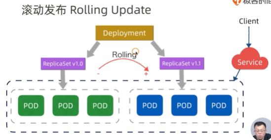
 
 即使发布失败了也可以通过deployment来回退版本，是一种更灵活的发布机制。
 特别强调一下，deployment和replicaset是个微服务 发布相关的两个最重要概念，也是发布过程中经常要使用的两个概念，我们的发布时候，所书写定义的发布描述文件，主要是yaml,json,里面主要就是deployment和replicaset的规范，所以这两个概念
必须完全理解。deployment是基于replicaset之上的概念，发布应用的时候 deployment会创建replicaset,replicaset会根据规范会创建应用pod实例，并且维护和保障pod的数量，升级的时候deployment会创建新的replicaset，调度实现滚动发布，也实现发布回退这些功能。
 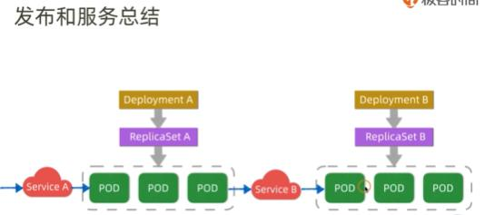
 上图中，两个应用的A和B 的发布，分别有两组deployment和replicaset,来控制和管理。service是服务间相互路由和寻址的概念，首先，Kubernetes集群内部的client通过service可以间接的访问目标应用的pod，其次Kubernetes集群外部的client如果要访问内部 的pdo也是通过 service间接访问。
 
 ### ConfigMap/Secret
 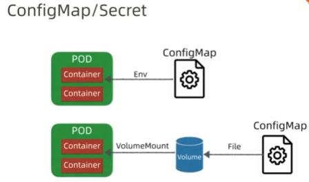
 Kubernetes中另一个核心概念，微服务在上线的时候常常需要设置一些可变配置，这些配置针对不同环境，对应的配置值不同，这些配置有些是在启动期一次性配置好，比如连接串，还有一些配置是在运行期动态调整的，比如ttl值、缓存时间，限购数量等，所以微服务需要配置中心的支持，实现针对不同环境的灵活的配置。
 Kubernetes平台内置支持微服务的配置，对应概念就叫configmap，是平台
 configmap是Kubernetes的一种资源，开发人员将配置填写在configmap中，支持将这些配置 以环境变量的形式注入到pod当中，pod中的应用以环境变量的形式去访问到这些配置，也支持以持久卷volume mnt到pod中，这样pod的中应用以本地配置文件的形式来访问这些配置，有些配置是涉及敏感数据的，比如用户名密码，案例证书等，Kubernetes通过secrect这种概念支持敏感数据的配置，
 Secret是一种特殊的configmap，提供更安全存储和访问配置的机制。也是经常用到的
 
 
  ### DaemonSet
 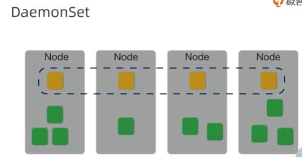
 还有一种场景 ，经常碰到 的，在每个节点上常驻一个守护进程（daemon），比如监控场景，需要在每个机器上部署一个日志采集进程，针对这种场景，Kubernetes支持一个叫daemontset的发布概念，
 在每个woker节点上部署一个守护进程pod，并且保证每个节点有且仅有一个这样的pod。
 
 ### 其他概念
 volume-磁盘文件存储，本地存储，远程 存储
 persistentvolume-超大磁盘存储抽象和分配机制
 persistentvolumeClaims-应用申请pv是要遵守的规范
 statefulset-有状态应用的发布机制，（replicaset是无状态应用发布）mysql,redis缓存
 job-跑一次的任务
 cronjob-周期的任务
 
  ### 补充概念
 Lable/Selector 对Kubernetes上的pod打标签 ，标识pod是属于前端还是后端，生产的还是测试的，Selector是通过标签查询label的机制
 namespace-逻辑隔离机制，
 readiness probe(就绪探针)-用于判定pod是否可以接入流量
 liveness probe(活跃探针)-用于判定pod是否存活
 
## 概念总结
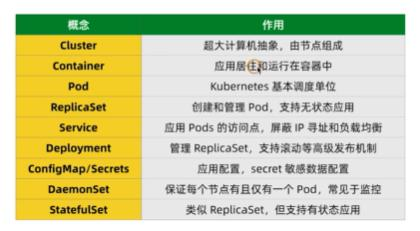
 
 
 ## kubernetes网络
 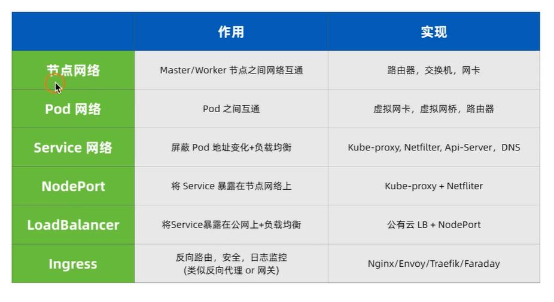
 
 ### kubernetes节点网络 
保证worker与worker节点之间的通讯，
 
 ### pod网络
 
 pod内的容器共享pod的网络栈，pod网络栈是由pod中的pause创建的，
 不同的容器共享pod的ip和端口，pod内的网络同节点之间的网络是通过虚拟的网桥来做关联的，并通过节点之间的路由规则访问到其他节点上的pod内的具体容器
 
  ### service网络
 
#### 服务发现原理service discovery
 一般在微服务中，服务发现是通过服务注册表和服务代理proxy，这些机制来配合实现。比如说spring cloud，当中通过 eureka和rebbion来可以实现服务发现，eureka是服务注册表，服务启动时会将实例地址注册到eureka，rebbion是相当于客户端代理，获取e上的服务实例地址列表，调用目标服务实例，调用时可以采用某种负载均衡策略，这是eureka和rebbion中的微服务服务发现机制。
 
 服务注册表master节点的apiserver
 代理，kubeprxy+netfilter（linux内核的代理机制，可以通过iptable规则来实现包过滤和转发）配合
 
 
 
 微服务与微服务之间是如果通讯的
 前后端分离如果验证权限
 