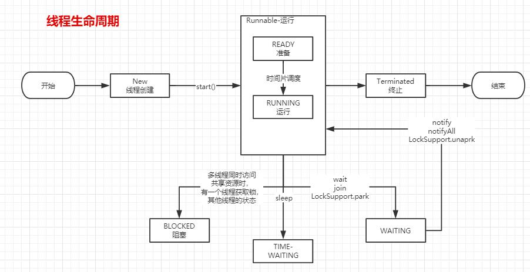

### 基础知识

#### Java中如何应用线程

线程就是可以合理利用多核心CPU资源，提高程序的吞吐量

+ Runnable接口实现
+ Thread类（本质上是对Runnable接口的实现）
+ Callable/Future带返回值的线程()
+ ThreadPool

#### 写个责任链来处理异步请求

责任链从链路构建来看是串行但每个处理逻辑是异步化的。
上代码：
```
LinkedBlockingQueue<Request> lbq =new LinkedBlockingQueue<>();
private RequestProcessor nextRequsetProcessor;
private volatile  Boolean isStop=false;

public void handle(Request request) {
      lbq.add(request);
}

while(!isStop){
            //处理逻辑
            try {
                Request request = lbq.take();
                System.out.println("Pre Request Processor:"+request.getName());
                nextRequsetProcessor.handle(request);
            } catch (InterruptedException e) {
                e.printStackTrace();
            }

        }

```


ps: ArrayBlockingQueue和LinkedBlockingQueue的功能是相同的，只不过是存储数据的结构不同，在LinkedBlockingQueue中保证线程并发安全所使用的的方式与ArrayBlockingQueue相似，都是通过使用重入锁ReentrantLock来实现的，不同的是ArrayBlockingQueue不论出队还是入队使用的都是同一把锁，因此ArrayBlockingQueue在实际使用使是不能出入队并发执行的，而LinkedBlockingQueue在这边方面则不同，LinkedBlockingQueue的出入队是各一把锁，分别控制出入队操作。

LinkedBlockingQueue源代码关键点：
0. 单链表
1. ReentrantLock重入锁（两把，入队和出队各一把）
2. 入队方法add/put/offer
3. 出队方法take(等)/poll(不等)
4. romove方法
5. size的统计

LinkedBlockingDueue是LinkedBlockingQueue的升级版
0. 双向链表
1. 功能全覆盖
2. 可做堆栈使用
3. 是个容量可选（最大为Integer.MAX_VALUE）的阻塞队列，且线程安全
4. ReentrantLock实现不过只有一把锁
5. 出/入队方法一大堆


课外：transient （短暂的; 转瞬即逝的; 倏忽; 暂住的; 过往的; 临时的;）关键字：被transient关键字修饰之后，该字段不会被序列化。transient的作用就是把这个字段的生命周期仅存于调用者的内存中而不会写到磁盘里持久化
java序列化提供两种形式，一是实现Serializable接口，另一个是实现Externalizabler接口并重写writeExternal和readExternal方法，效率比Serializable接口要高一些，并且可以指定那些属性是需要序列化的。

静态变量不管是不是transient关键字修饰，都不会被序列化。读出来的数据是从内存全局变量中取出来的，真正序列化文件并没有这个静态变量。

#### 线程的生命周期
画个图吧


#### 线程的各状态该怎么用程序模拟出来呢？

上代码：
```
public class BlockedStatus {


    public static void main(String[] args) throws Exception{
        new Thread(()->{
            try {
                while(true){
                    System.out.println("该线程是TimeWaiting，40秒");
                    TimeUnit.SECONDS.sleep(10);
                }
            } catch (InterruptedException e) {
                e.printStackTrace();
            }
        },"time-waiting-thread").start();

        new Thread(()->{
            while(true){
                System.out.println("该线程是申请类锁BlockedStatus.class");
                synchronized (BlockedStatus.class){
                    try {
                        System.out.println("该线程是申请类锁BlockedStatus.class，获取到了，开始处于等待状态，其它人玩蛋去吧");
                        BlockedStatus.class.wait();
                    } catch (InterruptedException e) {
                        e.printStackTrace();
                    }
                }
            }

        },"waiting-thread").start();

        new Thread(new BlockedDemo(),"Blocked-demo01-thread").start();
        new Thread(new BlockedDemo(),"Blocked-demo02-thread").start();
    }

    static class BlockedDemo extends Thread{
        @Override
        public void run() {
            System.out.println("我也来玩一玩，我是"+currentThread().getName());
            synchronized (BlockedDemo.class){
                System.out.println("不管了我获取到了，我是"+currentThread().getName());
                while(true){
                    try {
                        System.out.println("我是"+currentThread().getName()+",老子要睡觉了");
                        TimeUnit.SECONDS.sleep(10);
						System.out.println("我是"+currentThread().getName()+",老子要醒了，到你们");
                        break;
                    } catch (InterruptedException e) {
                        e.printStackTrace();
                    }
                }
            }
        }
    }
}
```