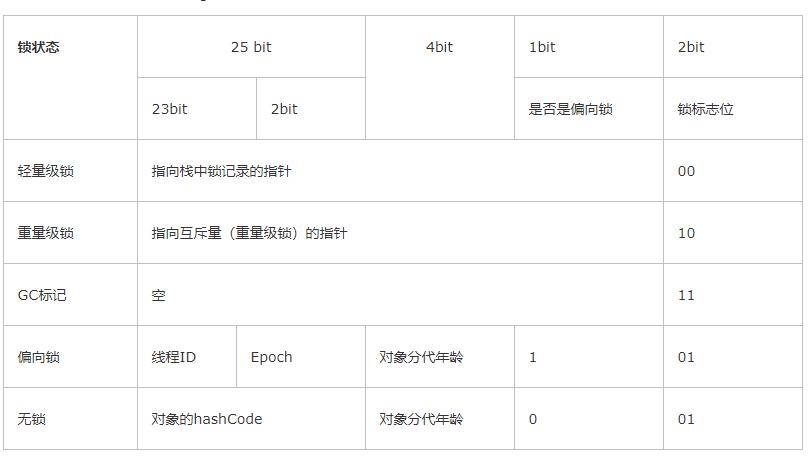
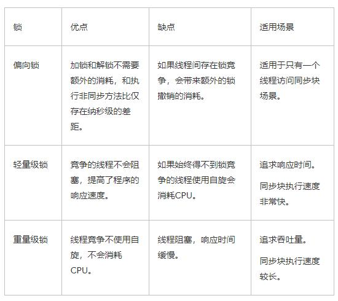

### 多线程基本原理

#### 有序性
有序性产生的原因：是JVM编译器为了优化性能有时候会对代码的先后顺序进行重排，导致代码的执行顺序不一，并由此会产生一系列诡异的问题。简单一句话：导致有序性的原因是编译优化
有序性的含义很明确，就是指程序按照代码的先后顺序执行。
在java中可通过synchronized或volatile关键字来保证其有序性，当然这都是基于Java内存模型来解决的

#### 原子性

大家都知道，线程在CPU上执行的前提是获得时间片，获得时间片后线程就获得CPU执行权，时间片用完就必须得把执行权交接给下一个线程。CPU的执行是以指令为最小单位的，这个单位并不是我们传统意义上的一行代码（一行代码也可能包含多个指令）。既然这样的话，就有得玩了，那就必须得定义好原子性这范围了。

我们把一个或多个操作在CPU上的执行过程中不被中断的特性叫作原子性。

保证原子性最简单的方式就是操作系统指令，但这是非常不容易的。

在java中对于这种常见问题的解决方案就是加锁，比如synchronized和lock都可以实现。这种方案可以归属于互斥锁的方案

#### 可见性
一个线程对共享变量的修改，另外一个线程能够立刻看到，我们称为可见性。

导致可见性的原因是缓存，导致有序性的原因是编译优化，那解决可见性、有序性最直接的办法就是禁用缓存和编译优化。
Java 内存模型规范了 JVM 如何提供按需禁用缓存和编译优化的方法。具体来说，这些方法包括 volatile、synchronized 和 final 三个关键字，以及六项 Happens-Before 规则。其它两个关键字都很常用，但是final怎么也玩一玩？final就是在向编译器发出一种信号`我是final，我生而不变，请使劲优化我`

##### Happens-Before 规则
正确的理解 ：前面一个操作的结果对后续操作是可见的

1. 程序的顺序性规则：在一个线程中，按照程序顺序前面的操作Happens-Before于后续的任意操作
2. volatile变量规则：对一个volatile变量的修改，Happens-Before于后续任何对于这个变量的读操作
3. 传递性：如果AHappens-Before于B,BHappens-Before于C,那个AHappens-Before于C
4. 管程中的锁：对一个锁的解锁操作Happens-Before于后续所有对这个锁的加锁
5. 线程的start()规则 ：主线程A启动子线程B后，子线程B能够看到主线程在启动子线程B前的操作
6. 线程的join()规则：主线程A等待子线程B完成（主线程 A 通过调用子线程 B 的 join() 方法实现），当子线程 B 完成后（主线程 A 中 join() 方法返回），主线程能够看到子线程的操作。
7. 线程中断规则：对线程interrupt()方法的调用先行发生于被中断线程的代码检测到中断事件的发生，可以通过Thread.interrupted()方法检测到是否有中断发生。
8. 对象终结规则：一个对象的初始化完成(构造函数执行结束)先行发生于它的finalize()方法的开始。

ps：管程是一种通用的同步原语，在 Java 中指的就是 synchronized，synchronized 是 Java 里对管程的实现

#### synchronized锁
synchronized基本作用：
1. 确保线程互斥的访问同步代码
2. 保证共享变量的修改能够及时可见
3. 有效解决重排序问题

synchronized用法：
1. 修饰实例方法
2. 修饰静态方法
3. 修饰代码块

Synchronized是通过对象内部的一个叫做监视器锁（monitor管程）来实现的，监视器锁本质又是依赖于底层的操作系统的Mutex Lock来实现的。而操作系统实现线程之间的切换这就需要从用户态转换到核心态，这个成本非常高，状态之间的转换需要相对比较长的时间，这就是为什么Synchronized效率低的原因。所以这种依赖于操作系统Mutex Lock所实现的锁我们称之为“重量级锁”。JDK中对Synchronized做的种种优化，其核心都是为了减少这种重量级锁的使用。JDK1.6以后，为了减少获得锁和释放锁所带来的性能消耗，提高性能，引入了“轻量级锁”和“偏向锁”。

#### 锁的状态

无锁->{偏向锁->轻量级锁}->重量级锁（真正意义的加锁），锁的升级是单向的并不会出降级

假如有两个线程Ta和Tb，JVM做锁优化
1. 只有Ta去访问->引入偏向锁（记录Ta的线程ID、偏向锁标记为1)
2. Ta和Tb交替访问->引入轻量级锁（自旋）
3. 多个线程同时访问->阻塞

升级锁过程：偏向锁\轻量级锁\重量级锁

##### 偏向锁

偏向锁升级过程，

CAS-乐观锁，（Compare and swap)、CompareAndSet

java1.6以前，基于重量级锁实现

自旋
for(;;){
	if(cas()){
		return;//绝大部分的线程在获得锁以后，在非常短的时间内很快会释放
	}
}

ps:绝大部分的线程在获得锁以后，在非常短的时间内很快会释放。自旋会占用CPU资源，所以在指定的自旋次数之后，还是没有获取得轻量级锁，会锁膨胀成重量级锁->阻塞

jvm参数设置自旋次数，preBlockSpin
自适应自旋，基于上一次自旋次数来判断

偏向锁则是在只有一个线程执行同步块时进一步提高性能

##### 轻量级锁

加锁过程：
解锁过程：

轻量级锁是为了在线程交替执行同步块时提高性能

##### 重量级锁

升级到重量级锁以后，没有获得锁的线程会被阻塞（Blocked状态）。

重量级锁基于对象监视器(Monitor---管程)来实现

管程模型，分别是：Hasen 模型、Hoare 模型和 MESA 模型。其中，现在广泛应用的是 MESA 模型

偏向锁----->轻量级锁
cas  ----->自旋锁/自适应自旋锁

无锁->轻量级锁-->重量级锁

#### 锁的区别

#### Wait/notify/nofityAll

wait是通过对象的monitor对象来实现的，只要在同一对象上去调用notify/notifyAll方法，就可以唤醒对应对象monitor上等待的线程了。notify和notifyAll的区别在于前者只能唤醒monitor上的一个线程，对其他线程没有影响，而notifyAll则唤醒所有的线程

#### sleep/yield/join
sleep：是让当前线程暂停指定的时间（毫秒）,注意区别wait方法依赖于同步，而sleep方法可以直接调用。sleep方法只是暂时让出CPU的执行权，并不释放锁。而wait方法则需要释放锁。

yield：暂停当前线程，以便其他线程有机会执行，不过不能指定暂停的时间，并且也不能保证当前线程马上停止。

join：父线程等待子线程执行完成后再执行，换句话说就是`将异步执行的线程合并为同步的线程`。

#### volatile
作用：
1. 防止重排序
2. 实现可见性
3. 保证原子性（别误会，是无法保证多个操作是具有原子性的）

对于volatile关键字的误解：

* 把volatile关键字当成一种锁机制，认为给变量加上了volatile后，就好像是给函数加上了synchronized关键字一样，不同的线程对于特定线程的访问会去加锁
* 把volatile当成一种原子化操作机制，认为加上volatile之后，对于变量的自增操作就会变成原子性的了
