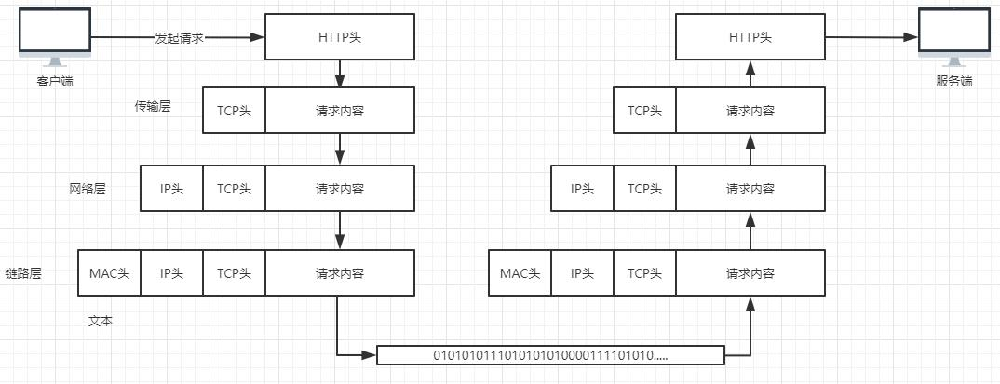
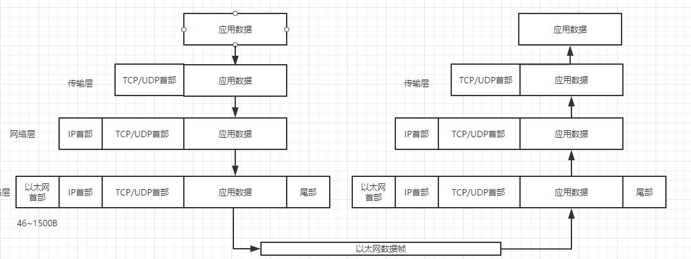
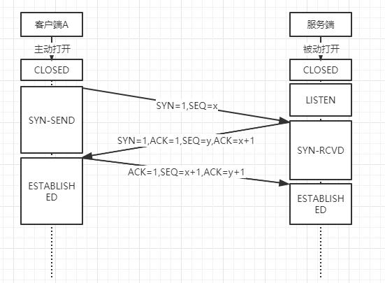
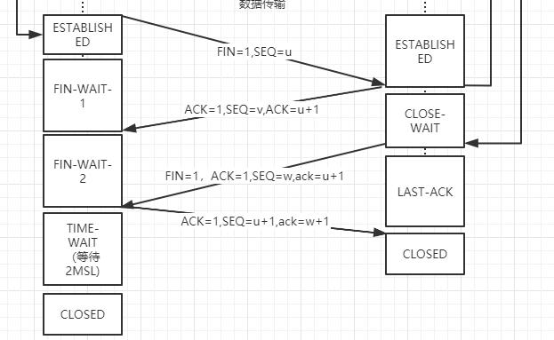
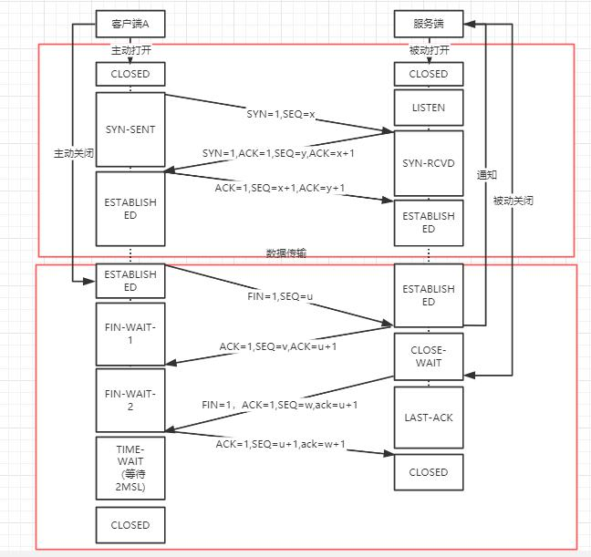
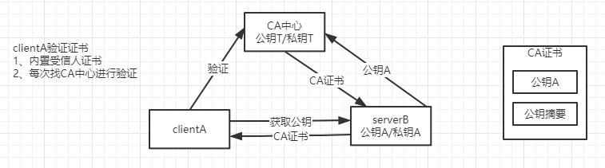

## 分布式

#### 网络模型

OSI七层模型:应用层、表示层、会话层、传输层、网络层、数据链路层、物理层

TCP四层模型：应用层、传输层、网络层、链路层

大家来体会一下，以下这张图是不是正确的？


 
 
 关于负载均衡，是根据OSI模型来划分的。（[来一个很牛逼的链接](https://blog.csdn.net/zzhongcy/article/details/40046581?depth_1-utm_source=distribute.pc_relevant.none-task-blog-BlogCommendFromBaidu-1&utm_source=distribute.pc_relevant.none-task-blog-BlogCommendFromBaidu-1)
 二层负载：数据链路层负载均衡。主要的实现方式就是PPP捆绑和链路聚合技术。`通过虚拟的MAC地址接收请求，然后分配到真实的mac地址`
1. 链路聚合技术。以太网链路聚合，它通过将多条以太网物理链路捆绑在一起成为一条逻辑链路，从而实现增加链路带宽的目的。LACP协议
2. PPP捆绑技术。是将多个物理链路合并或者捆绑成一个大逻辑链路机制，主要起到增加带宽，减少延时，线路备份的作用。另一个作用是将不同类型的接口捆绑成为一个逻辑接口。
 三层负载：通过一个虚拟的Ip地址接收请求，然后分配到真实节点上。（OSPF协议，RIP协议）
 四层负载：通过虚IP+端口接收请求（F5、LVS、nginx-stream模块、haproxy)，基于TCP协议，类似于路由器
 七层负载：基于url应用层信息的LB通过虚拟的url或主机名接收请求(haproxy、nginx、apache、mysql proxy)，基于http协议，类似于代理服务器，相比四层来说更占CPU,
 高层负载：1）http重定向协议实现负载均衡、2）dns域名解析负载均衡、3）反向代理负载均衡

#### TCP
建立连接三次握手

第一次握手：建立连接时，客户端发送syn包（syn=x）到服务器，并进入SYN_SENT状态，等待服务器确认；SYN：同步序列编号（Synchronize Sequence Numbers）。

第二次握手：服务器收到syn包，必须确认客户的SYN（ack=x+1），同时自己也发送一个SYN包（syn=y），即SYN+ACK包，此时服务器进入SYN_RECV状态；

第三次握手：客户端收到服务器的SYN+ACK包，向服务器发送确认包ACK(ack=y+1），此包发送完毕，客户端和服务器进入ESTABLISHED（TCP连接成功）状态，完成三次握手。


关闭连接四次挥手

1）客户端进程发出连接释放报文，并且停止发送数据。释放数据报文首部，FIN=1，其序列号为seq=u（等于前面已经传送过来的数据的最后一个字节的序号加1），此时，客户端进入FIN-WAIT-1（终止等待1）状态。 TCP规定，FIN报文段即使不携带数据，也要消耗一个序号。
2）服务器收到连接释放报文，发出确认报文，ACK=1，ack=u+1，并且带上自己的序列号seq=v，此时，服务端就进入了CLOSE-WAIT（关闭等待）状态。TCP服务器通知高层的应用进程，客户端向服务器的方向就释放了，这时候处于半关闭状态，即客户端已经没有数据要发送了，但是服务器若发送数据，客户端依然要接受。这个状态还要持续一段时间，也就是整个CLOSE-WAIT状态持续的时间。
3）客户端收到服务器的确认请求后，此时，客户端就进入FIN-WAIT-2（终止等待2）状态，等待服务器发送连接释放报文（在这之前还需要接受服务器发送的最后的数据）。
4）服务器将最后的数据发送完毕后，就向客户端发送连接释放报文，FIN=1，ack=u+1，由于在半关闭状态，服务器很可能又发送了一些数据，假定此时的序列号为seq=w，此时，服务器就进入了LAST-ACK（最后确认）状态，等待客户端的确认。
5）客户端收到服务器的连接释放报文后，必须发出确认，ACK=1，ack=w+1，而自己的序列号是seq=u+1，此时，客户端就进入了TIME-WAIT（时间等待）状态。注意此时TCP连接还没有释放，必须经过2∗∗MSL（最长报文段寿命）的时间后，当客户端撤销相应的TCB后，才进入CLOSED状态。
6）服务器只要收到了客户端发出的确认，立即进入CLOSED状态。同样，撤销TCB后，就结束了这次的TCP连接。可以看到，服务器结束TCP连接的时间要比客户端早一些。




#### Https协议

Https协议详解，目的是建立一个加密的安全传输通道。


* 对称加密：使用密钥进行对称加密传输（随机数）
* 非对称加密：协商密钥
* 摘要算法:防篡改-sha、md5


#### 序列化与反序列化

```Java
@Data
@AllArgsConstructor
@ToString
public class User implements Serializable {
	
	private static final long serialVersionUID=1L;

    private String name;

    private Integer age;

}

public class ServerDemo {

    public static void main(String[] args) throws IOException, ClassNotFoundException {
        ServerSocket socketServer=null;
        socketServer=new ServerSocket(8888);
        Socket socket=socketServer.accept();

        ObjectInputStream inputStream=new ObjectInputStream(socket.getInputStream());

        User user=(User)inputStream.readObject();

        System.out.println(user);
    }
}

public class ClientDemo {

    public static void main(String[] args) throws IOException {
        Socket socket=null;
        socket=new Socket("localhost",8888);
        User user=new User("lihaha",32);

        ObjectOutputStream outputStream=new ObjectOutputStream(socket.getOutputStream());

        outputStream.writeObject(user);

        outputStream.flush();
        socket.close();
    }
}
```

序列化的价值：
1. 远程传输
2. 可以通过序列来实现对象的存储

序列化的方式：
1. java原生序列化方式
```Java
ObjectInputStream inputStream=new ObjectInputStream(socket.getInputStream());
User user=(User)inputStream.readObject();//反序列化

ObjectOutputStream outputStream=new ObjectOutputStream(socket.getOutputStream());
outputStream.writeObject(user);//序列化

```
`serialVersionUID`，做安全性的识别
`transient`,设置该对象不被序列化，可以通过writeObject/readObject来修改该功能。

2. Json/xml/hession/avro/kyro/protobuf序列化工具
为什么要在rpc框架定义各种序列机制呢？序列化涉及到什么？

影响rpc通信性能的因素：
1. 序列化的计算性能
2. 数据包的大小
3. 跨语言


在选择序列化实现的时候，需要综合考虑`数据可读性`，`实现复杂度`，`性能`和`信息密度`这四个因素,大多数情况下，选择一个高性能的通用序列化框架都可以满足要求，在性能可以满足需求的前提下，推荐优先选择 JSON 这种可读性好的序列化方法

选择合格的序列化实现，也是性能优化的一种手段

xml
json
fastjson
hession
avro
kyro
protobuf:生成过程比较麻烦，所以有了protostuf，对性能要求比较高的话可以用这种。

序列化的过程：对象-->byte[]

序列化的结果是没有影响的，只要能反序列出来就行


#### RPC框架原理

1. 基本的通信
2. 通过注解的方式来发布一个服务
3. 支持多版本实现
