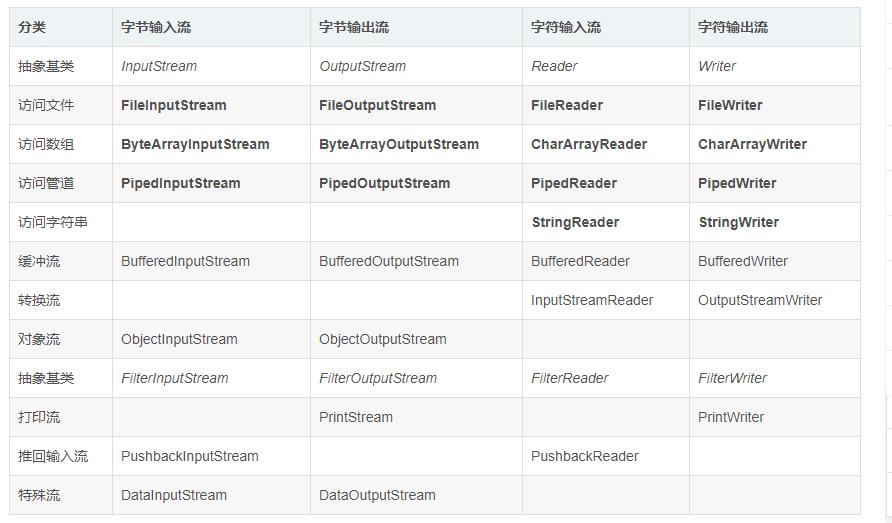

## IO流系统学习

在java中把不同的输入/输出源（键盘、文件、网络连接等）抽象表述为流。通过流的形式允许java程序使用相同的方式访问不同输入/输出源。java中所有的传统的流类型都放到了java.io包下，用于实现输入和输出功能。

### 流的分类

#### 输入流/输出流

+ 输入流： 只能从中读取数据，而不能向其写入数据。
+ 输出流：只能向其写入数据，而不能向其读取数据。

java的输入流主要是InputStream和Reader作为基类，而输出流则是主要由outputStream和Writer作为基类。它们都是一些抽象基类，无法直接创建实例。

#### 字节流/字符流

字节流和字符流的用法几乎完成全一样，区别在于字节流和字符流所操作的数据单元不同，字节流操作的单元是数据单元是`8位的字节`，字符流操作的是数据单元为`16位的字符`。

字节流主要是由InputStream和outPutStream作为基类，而字符流则主要有Reader和Writer作为基类。

#### 节点流/处理流

可以从/向一个特定的IO设备（如磁盘，网络）读/写数据的流，称为节点流。
处理流则用于对一个已存在的流进行连接和封装，通过封装后的流来实现数据的读/写功能。


### 流的原理

Java Io流的40多个类都是从如下4个抽象类基类中派生出来的：

+ InputStream/Reader: 所有的输入流的基类，前者是字节输入流，后者是字符输入流。
+ OutputStream/Writer: 所有输出流的基类，前者是字节输出流，后者是字符输出流。

#### 常用流分类表



### 流的基类

InputStream和Reader是所有输入流的抽象基类，本身并不能创建实例来执行输入，但它们将成为所有输入流的模板，所以它们的方法是所有输入流都可使用的方法。

1. 在InputStream里面包含如下3个方法：
+ int read(); 从输入流中读取单个字节，返回所读取的字节数据（字节数据可直接转换为int类型）。
+ int read(byte[] b)从输入流中最多读取b.length个字节的数据，并将其存储在字节数组b中，返回实际读取的字节数。
+ int read(byte[] b,int off,int len); 从输入流中最多读取len个字节的数据，并将其存储在数组b中，放入数组b中时，并不是从数组起点开始，而是从off位置开始，返回实际读取的字节数。

2. 在Reader中包含如下3个方法:

+ int read(); 从输入流中读取单个字符，返回所读取的字符数据（字节数据可直接转换为int类型）。
+ int read(char[] b)从输入流中最多读取b.length个字符的数据，并将其存储在字节数组b中，返回实际读取的字符数。
+ int read(char[] b,int off,int len); 从输入流中最多读取len个字符的数据，并将其存储在数组b中，放入数组b中时，并不是从数组起点开始，而是从off位置开始，返回实际读取的字符数。

3. InputStream和Reader提供的一些移动指针的方法：

* void mark(int readAheadLimit); 在记录指针当前位置记录一个标记（mark）。
* boolean markSupported(); 判断此输入流是否支持mark()操作，即是否支持记录标记。
* void reset(); 将此流的记录指针重新定位到上一次记录标记（mark）的位置。
* long skip(long n); 记录指针向前移动n个字节/字符。

4. OutputStream和Writer
两个流都提供了如下三个方法：

* void write(int c); 将指定的字节/字符输出到输出流中，其中c即可以代表字节，也可以代表字符。
* void write(byte[]/char[] buf); 将字节数组/字符数组中的数据输出到指定输出流中。
* void write(byte[]/char[] buf, int off,int len ); 将字节数组/字符数组中从off位置开始，长度为len的字节/字符输出到输出流中。

Writer里面还包含如下两个方法:

* void write(String str); 将str字符串里包含的字符输出到指定输出流中。
* void write (String str, int off, int len); 将str字符串里面从off位置开始，长度为len的字符输出到指定输出流中。


写了好多代码：

```
public class ReadFile {

    public static void main(String[] args) throws IOException {
        String path="D:\\MongoDB\\Server\\4.2\\log\\mongod.log";
        String pathNew="D:\\MongoDB\\Server\\4.2\\log\\mongodNew.log";
        //reader(path);//字符流
        //input(path);//字节流

        //output(path,pathNew);
        //buffer(path,pathNew);
        //systemin();

        //writeObject();

        readObject();
    }
    public static void readObject(){
        InputStream inputStream=null;
        BufferedInputStream buf=null;
        ObjectInputStream obj=null;
        try {
            //序列化文件輸入流
            inputStream=new FileInputStream("D:\\MongoDB\\Server\\4.2\\log\\myfile.tmp");
            //构建缓冲流
            buf=new BufferedInputStream(inputStream);
            //构建字符输出的对象流
            obj=new ObjectInputStream(buf);
            //序列化数据写入
            User user=(User)obj.readObject();//Person对象
            System.out.println(user.toString());
            //关闭流
            obj.close();
        }  catch (Exception e) {
            e.printStackTrace();
        }
    }
    public static void writeObject(){
        OutputStream outputStream=null;
        BufferedOutputStream buf=null;
        ObjectOutputStream obj=null;
        try {
            //序列化文件輸出流
            outputStream=new FileOutputStream("D:\\MongoDB\\Server\\4.2\\log\\myfile.tmp");
            //构建缓冲流
            buf=new BufferedOutputStream(outputStream);
            //构建字符输出的对象流
            obj=new ObjectOutputStream(buf);
            //序列化数据写入
            obj.writeObject(new User(1L,"A", "123123"));//Person对象
            //关闭流
            obj.close();
        } catch (FileNotFoundException e) {
            e.printStackTrace();
        } catch (IOException e) {
            e.printStackTrace();
        }
    }

    private static void systemin(){
        InputStreamReader reader=new InputStreamReader(System.in);
        BufferedReader br=new BufferedReader(reader);
        String buffer=null;
        try {
            while((buffer=br.readLine())!=null){
                if(buffer.equalsIgnoreCase("exit")){
                    System.exit(1);
                }
                System.out.println("input:"+buffer);
            }
        } catch (IOException e) {
            e.printStackTrace();
        } finally {
        }
    }

    private static void buffer(String path,String pathNew){
        FileInputStream fis=null;
        FileOutputStream fos=null;
        BufferedInputStream bis=null;
        BufferedOutputStream  bos=null;

        try {
            fis=new FileInputStream(path);
            fos=new FileOutputStream(pathNew);
            bis=new BufferedInputStream(fis);
            bos=new BufferedOutputStream(fos);

            byte[] b=new byte[2048];
            int hasRead=0;
            while((hasRead=bis.read(b))>0){
                bos.write(b,0,hasRead);
            }
        } catch (IOException e) {
            e.printStackTrace();
        } finally {
            try {
                bis.close();
                bos.close();
                //只关闭最上层的流即可
            } catch (IOException e) {
                e.printStackTrace();
            }
        }
    }

    private static void output(String path,String pathNew){
        FileInputStream fis=null;
        FileOutputStream fos=null;
        try{
            fis=new FileInputStream(path);
            fos=new FileOutputStream(pathNew);
            byte[] b=new byte[1024];
            int hasHead=0;
            while((hasHead=fis.read(b))>0) {
                fos.write(b,0,hasHead);
            }
        }catch (IOException e){
            e.printStackTrace();
        }finally {

                try {
                    if(fis!=null)
                        fis.close();
                    if(fos!=null)
                        fos.close();
                } catch (IOException e) {
                    e.printStackTrace();
                }
        }
    }

    private static void input(String path){
        FileInputStream fis=null;

        try {
            fis=new FileInputStream(path);
            byte[] b=new byte[1024];
            int hashead=0;
            while((hashead=fis.read(b))>0){
                System.out.println(new String(b,0,hashead));
            }
        } catch (IOException e) {
            e.printStackTrace();
        }finally {
            if(fis!=null) {
                try {
                    fis.close();
                } catch (IOException e) {
                    e.printStackTrace();
                }
            }
        }

    }

    private static void reader(String path){

        FileReader fileReader=null;
        try {
            fileReader=new FileReader(path);
            char[] b=new char[1024];
            int hasRead=0;
            while((hasRead=fileReader.read(b))>0){
                System.out.println(new String(b,0,hasRead));
            }

        } catch (IOException e) {
            e.printStackTrace();
        }finally {
            if(fileReader!=null) {
                try {
                    fileReader.close();
                } catch (IOException e) {
                    e.printStackTrace();
                }
            }
        }
    }
}
```
