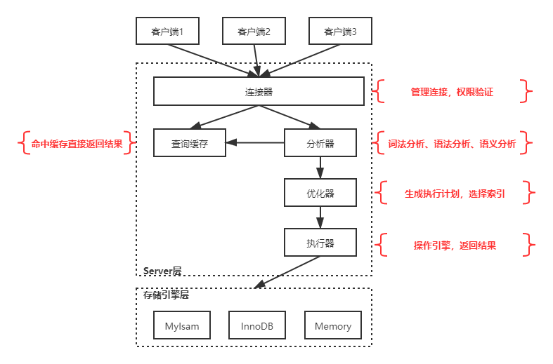

### MySQL知识体系梳理
写在前面的话：由于工作原因所以对于MySQL的使用总是那么随意，这也就导致MySQL对我总是那么充满着敌意，对于mysql的使用总那么的肤浅，以甚至于连MySQL漏洞升级都搞不定，这一点对于一个立志成为一名架构师的我来说无疑是非常打击的。所以我想系统的学习一下mysql的知识，目标不是说当一个数据库dba,但是要求对mysql的基础知识有一个系统的掌握，对，是掌握不是了解。好吧为了这次mysql知识体系的进阶之旅，我选择了mysql官网、《MySQL实战45讲》、《从零开始带你成为Mysql实战优化高手》以及gp学院的性能优化mysql系列。希望先从广度上给自己建立一个多渠道的知识来源地，吸各家之所长为我所用，检验自己学习成果的方式是通过博客公众号的输出，面试等。最起码在遇到mysql的问题时，自己有一个清晰且合理的思路来搞定它。
这几个学习mysql的系列课程里面丁奇的《mysql实战45》可以算得上是专家级的，做为一个标杆。

以下是对mysql知识体系知识点的梳理希望能有一个全面的掌握：
#### mysql基础架构

##### 连接器
连接器负责跟客户端建立连接、获取权限、维持和管理连接。命令如下 ：
```
	mysql -h$ip -P$port -u$user -p
```
客户端默认连接时间由参数wait_timeout控制，为8小时
##### 查询缓存
mysql在拿到一个sql之后会先到查询缓存中看看，之前是不是执行过这条语句。之前执行过的语句及其结果可能会以key-value对的形式，被直接缓存在内存中。key是sql，value是结果。如果查询sql刚好在缓存中，其对应的value则直接会返回给客户端。
当然，这种查询缓存的实现是需要进行维护的，而这种维护也是需要耗费很大的代价，所以可以按需进行使用，
```
	query_cache_type=demand #这样就不使用查询缓存了
```
从现在的角度来看，这个查询缓存的功能设计的确是有点鸡肋了，所以8.0把该功能拿下也是在情理之中的，对不对。
##### 分析器
顺序：词法分析->语法分析->语义分析
##### 优化器
优化器:在一张表里面有多个索引的时候，决定使用哪个索引。或者使用关联查询时，决定各表的连接顺序。
##### 执行器
调用存储引擎对应接口，以以下sql为例
```
select * from T where ID=10；
```
执行器会先判断一下当前用户对T表是否有执行权限，如果没有就会返回错误。以T表为例，假如该表不存在索引，简述执行器执行流程：从该表中读取第一行，然后判断 ID是否为10，如果不是则跳过，如果是就把这一条放到结果集中。然后再调用存储引擎的下一行，再重复进行判断，直到该表的最后一条为止。有索引也是一样的处理流程。
#### mysql日志系统
#### 事务隔离级别与实现
#### mysql的索引
#### mysql的全局锁、表锁、行锁
#### InnoDB的事务和锁
#### 表锁、行锁和一致性读
#### 间隙锁和next-key lock
#### InnoDB的加锁规则
#### 获取表行数的方法
#### 普通索引与唯一索引
#### 如何选择索引
#### 给字符串加索引
#### InnoDB脏而的控制策略
#### 日志和索引常见问题
#### binlog和redo log的写入机制
#### 大查询
#### 数据库表的空间回收
#### 表的复制
#### 临时表排序的执行过程
#### binlog的格式和基本机制
#### 可靠性优先与可用性优先策略
#### 多线程复制策略
#### 一主多从的主备切换流程
#### 读写分离
#### 对索引字段的函数操作
#### 提高性能的紧急手段
#### 对mysql实例状态检测
#### 误删数据
#### kill命令
#### join语句
#### groupby算法
#### insert语句
#### grant和flush privileges语句
#### 临时表
#### 内存表的特性与适用场景
#### 分区表
#### 自增主键
#### orderby的算法流程