[spring5](https://www.cnblogs.com/xingyunblog/p/9685467.html)

beanfactory 和applicationcontext的区别

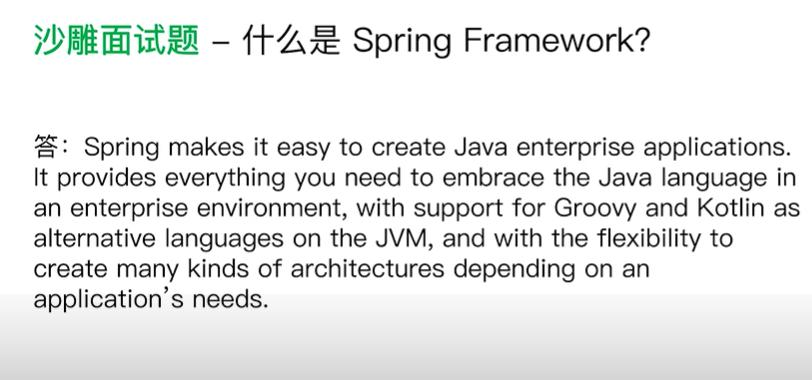
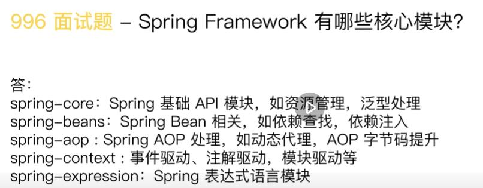
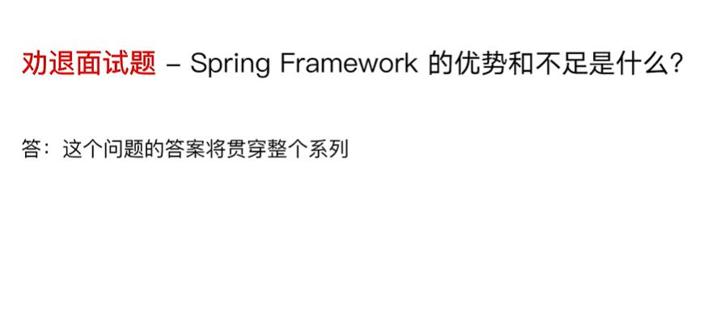

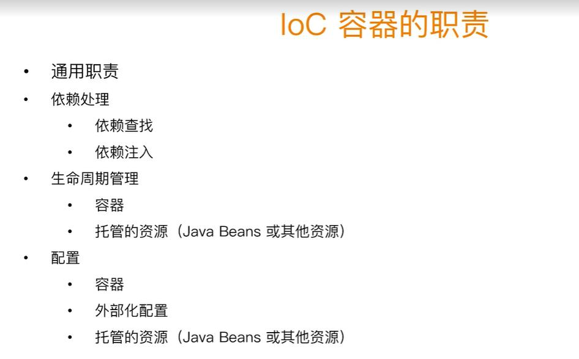
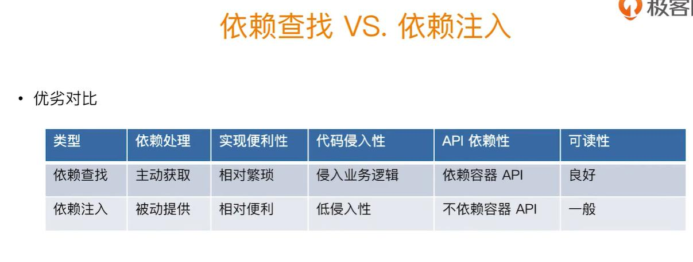

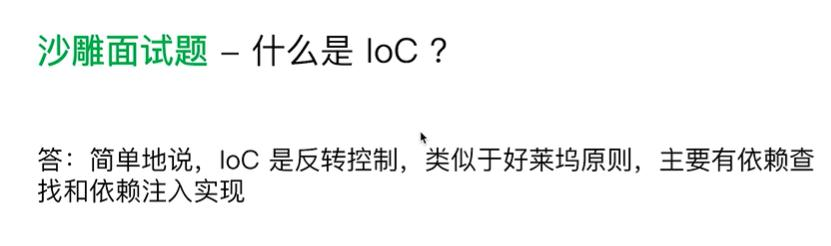
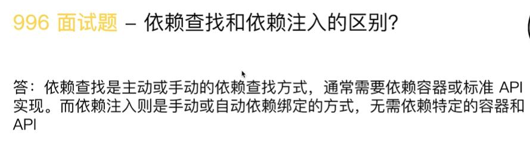
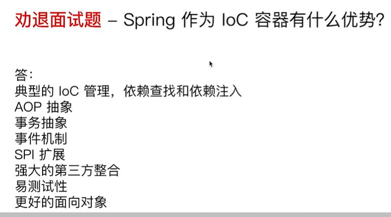

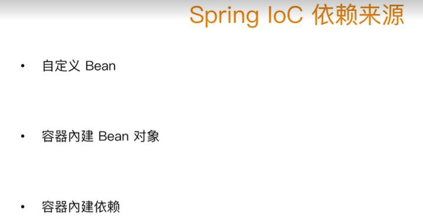
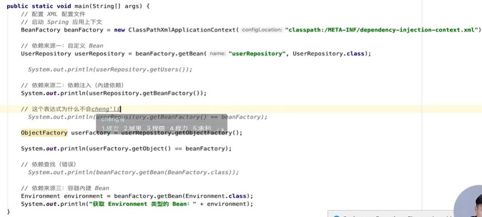

beanfactory

beanfacoty:是一个底层的Ioc容器
applicationcontext 在他它的基础上面增加了一些特性，是beanfacotry的超集

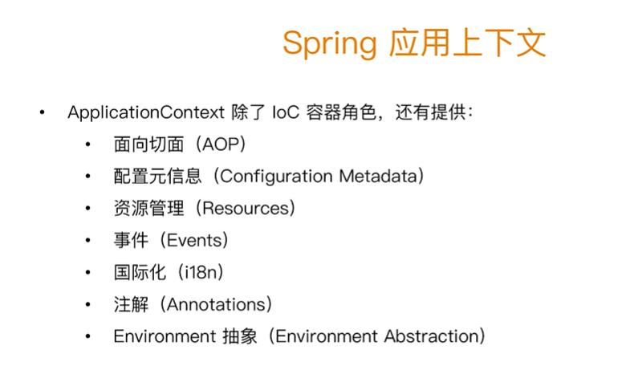

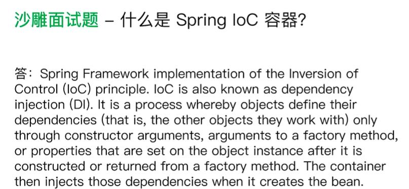

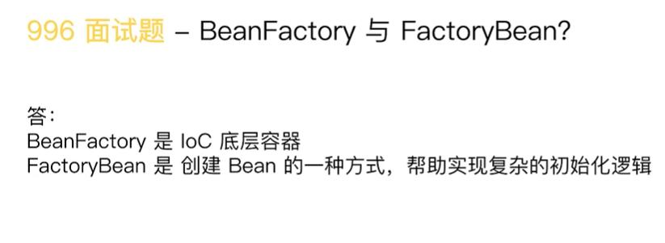

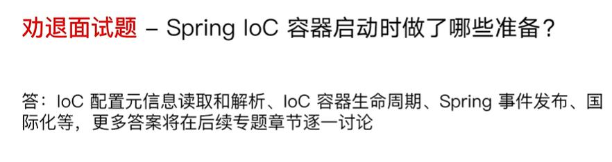