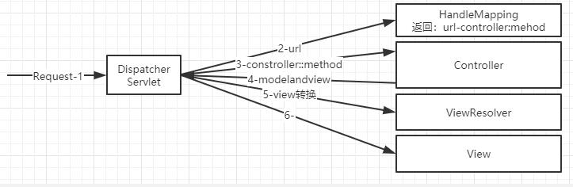
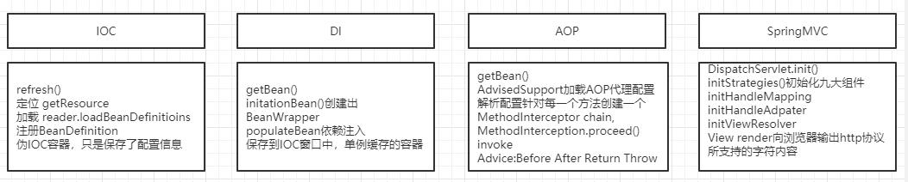

课程目标：
spring基本架构及各子模块之间的依赖关系
spring前世今生
spring版本升级规律
gradle构建spring5

spring

spring基于pojo来升级，来简化开发。

简化开发的策略
1、基于pojo的轻量级和最小侵入性编程
2、通过依赖注入和面向接口松耦合
3、基于切面 和惯性进行声明式编程
4、通过切面 和模板减少样板式代码

DI==(依赖)=>IOC<==(依赖)AOP

IOC:控制反转，把对象控制权交给spring,由ioc容器统一管理。
DI:依赖注入，动态（自动）赋值
AOP:切面，连接点，切入点，

spring模块图

核心窗口：beans、core、context、Expression

aop：aspects,Instrument,Mesaging

数据访问：jdbc,orm,oxm,jms
web

spring-core:依赖注入ioc与di的基本实现
spring-beans:bean工厂与Bean装配
spring-context:定义基础的spring的context上下文即ioc容器
spring-context-support：对spring ioc容器的扩展与支持，以及ioc子容器
spring-context-indexer：spring的类管理组件和classpath扫描
spring-expression:spring表达式语言

spring-aop:面向切面编程的应用模块,整合asm，cglib，jdkproxy
spring-aspects：集成aspectJ,aop应用框架
spring-instrument：动态class loading模块，

spring-jdbc:spring提供的jdkbc抽象框架的主要实现模块，用于简化spring jdbc操作
spring-tx:springjdbc事务控制模块
spring-orm：主要集成hibernate,java persitence api(jpa)和java data objects （jdo)
spring-oxm:将java对象映射成，xml数据，或者将xml数据映射 成java对象
spring-jms：java messaging service 能够发送和接收信息

spring-web：提供了最基础的web支持，主要建立 于核心容器之上，通过servlet或者listener来初始化ioc窗口
spring-mvc:实现了spring mvc ,的web应用
spring-websocket：主要是与web前端的全双工通讯协议
spring-webflux:一个新的非堵塞函数式reactive web框架，可以用来建立 异步，非阻塞，事件驱动 的服务

版本规则：
x.y.z 
x主版本号，当api的兼容性发生变化 时，x需递增 
y次版本号，当增加功能是（不影响api兼容性）y需递增
z修订号，当做bug修复时，z需递增 

为什么内存还有2g多，一个tomcat都 启动不了

spring Ioc容器初始化流程
======================

IOC，控制反转：就是反情感的先我们代码里面需要实现的对象创建、依赖的代码，反转给容器来帮忙实现

DI 依赖注入：就是批对象是被 动接受依赖类而不是自己主动去找，换句话说就是批对象不是从窗口中查找 它依赖的类，而是在容器实例化对象的时候主动将它依赖的类注入给它

对象 和对象 的关系 怎么表示？
xml/properties
用来表示 对象关系 的配置文件

描述对象 关系 的文件存放 在哪里
classpath/network/filesystem/servletContext
web.xml classpath:web.xxx

如何统一配置文件的标准？
BeanDefinition,把配置文件保存到该类的对象中，初始化到容器中，采用`单例模式`
顶级对象，保存配置文件的标准，BeanDefinition 在Ioc容器里

如何对不同的配置文件进行解析
策略模式。spring核心类,BeanFactory最顶层接口。

BeanFactory 编译容器
BeanDefinitaion 存储信息
BeanDefinitaionReader 读取信息

Ioc容器初始化过程：
1. 定位（定位配置文件和扫描相关注解）
2. 加载-将配置信息载入到内存中
3. 注册-根据载入的信息，将对象初始化对IOC容器中

详细过程
1. 寻找入口-refresh()->获取配置文件路径getResource() ->容器开始启动refreshBeanfactory()->开始解析配置文件路径getResourceByPath ->载入配置文件路径loadBeanDefinitions()->分配路径处理策略deletage ->解析配置文件路径(调用defaultBeanDefinitionReader())->加载配置文件信息->开始解析配置文件loadDocument()
2. ->分配 解析配置文件策略BeanDefinitionDocumentLoader->将配置文件载入到内存registerBeanDefinition()->载入bean元素parseDefaultElment()->载入property元素->输入property子元素->载入list元素
3. ->分配注册策略Utils.registerBeanDefinition()->开始 向容器注册DefaultListableBeanFactory.registerBeanDefinition()

DispacthcerServlet 加载九大组件

容器是通过继承来完成的

基于Annotation容器初始化过程
定位Bean扫描路径->读取元数据->解析->注册Bean

AnnotationConfigApplicationContext

DI-依赖注入的全过程
基于Ioc容器来实现

1、IOC容器
BeanFactory getBean()接口定义，abstractBeanFactory实现
2、实例化策略（默认策略SimpleInstantialStrategy)
3、存储实例
BeanWrapper存储实例所有相关信息的scope proxy instance

Ioc入口
1、用户第一次䚲getBean()方法时
2、用户在配置文件中将<bean></bean>元素配置了lazy-init=false属性，即让容器在解析bean定义时触发注入

依赖注入执行细节

寻找入口->开始实例化->选择实例化策略->执行实例化->准备依赖注入->解析注入规则 -->注入赋值

实例化阶段
BeanFacotry ---getBean()--->AbstractBeanFactory[--doGetBean()->CreateBean(创建Bean实例对象)--->doCreateBean(

1、factoryBeanInstanceCache(beanwrapper,单例容器)
2、createBeanInstance（创建Bean实例，instantiateBean返回BeanWrapper）
3、populateBean（注入）
对 属性注入方法
)]--->applyPropertyValues()
注入阶段
BeanDefinitionResolver--setPropertyValues()--->AbstractPropertAccessor--->NestablePropertyAccessor--->BeanWrapperImpl(invoke())

FactoryBean和BeanFacotry

FactoryBean是spring内部实现的一种规范，以&开头的BeanName
spring中的所有容器都是factorybean,因为容器本身也由窗口管理，root来创建，都是单例放在IOC容器中

BeanFactory：是Bean工厂的顶层规范，只是定义了getBean()方法，
工厂模式的应用，要使用容器必然要是Beanfactory的实现类才可以，

### AOP
#### 概念

切面：Aspect，面向规则，具有相同规则方法的集合体
通知：回调
目标对象：需要代理的具体方法
AOP代理：JDK\CGLib
前置通知:在invoke poincut之前的调用，织入方法@Before
后置通知：pointcut之后 调用，织入方法@After
返回后通知：返回值为非void，织入的方法@AfterReturn
环绕通知：只要触发调用，织入的方法@Around
异常通知：pointcut 抛出异常，织入的方法@AfterThrowing
 
#### 源码分析
寻找入口->选择策略(创建代理对象)->调用方法->触发通知

#### 总结IOC DI AOP

#### Spring MVC

初始化阶段：DispatcherServlet，核心方法-initStraties()完成组件初始化阶段
调用阶段：doService()

##### 九大组件
1. HandlerMapping:用于查找handler方法,标记注解的方法可以当成是handler,方法对应关系的保存
2. HandlerAdpaters:适配器，request,response。
3. HandlerExceptionResolvers：用来处理handler中产生异常的组件，异常产生之后渲染规则的转化器，解耦，单一职责体现
4. ViewResolvers：视图解析器，freemarker\jsp\volicity
5. RequestToViewNameTranslator:从request从获取viewName
6. LocaleResolver:国际化，从浏览器拿到，语言环境
7. ThemeResolver：主题，换皮肤，解析，插件
8. MultipartResolver：文件上传组件，提供getFile方法
9. FlashMapManager：flashmap的管理类，redirect重定向时转递参数，非显式传递参数，主要做参数中转。

##### springmvc源码分析
##### 
初始化阶段:HttpServletBean(init)----initServletBean()--->FrameworkServlet-----initwebApplicationContext(初始化容器)--->OnRefresh()----->DispacherServlet---->initStraties(九大组件)

initStraties(){
	初始化文件上传,语言环境化，主题，handlermapping,适配器
}

调用阶段:
DispatcherServlet---doService(返回)---doDispatch()----getHandler(继续)-->AbstractHandleMapping---getHandle()---getHandlerExecution(返回到doService)

getHandler(继续)--getHandlerAdpater--->HandleInterceptor---preHandle--->RequestMappingHandleAdpter---handle()--getModelandView()--->postHandle()---procesDispatchResult---rendar

##### springmvc优化建议
1. controller如果能保持单例，尽量使用单例。spring默认是单例模式，因为高并发下能极大的节省资源，提高服务抗压能力，可以通过@Scope(value="prototype")改成多例模式。这就取决于是否有成员变量，所以尽量不要使用非静态的成员变量。但非要用成员变量时，通过注解@Scope("prototype")，将其设置为多例模式。否则会有线程安全问题。那要是在controller里面注入了Service,这时候controller还是单例的吗？还是线程安全的吗？这两个问题问的不对，controller 是不是单例跟里面有什么变量、有什么方法没有关系，这只是一个设置问题，就算是单例，你在controller里面写了非静态的成员变量，那它还是单例，只不过是该成员变量会存在线程安全的问题而矣，你虽然注入了一个service，但是你会改这个service吗？应该不会吧，你只是调用呀，不改动为什么会线程安全的问题呢？傻瓜。这个问题算是搞弄了吧
2. @RequestParam,给具体的参数和url中的参数进行一对一匹配
3. springmvc并没有对url和method对应关系进行缓存,建议对url和method关系进行缓存

#### spring四大核心总结

### spring jdbc

#### 数据库事务基本原理
